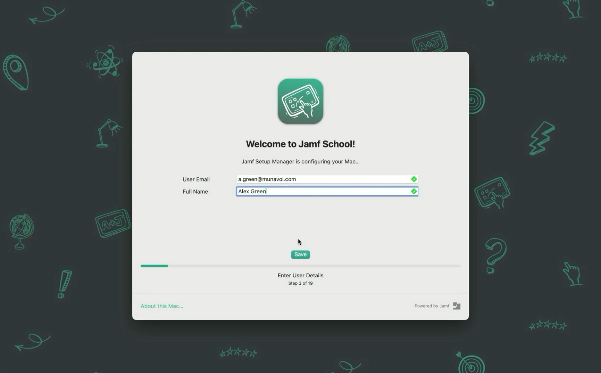
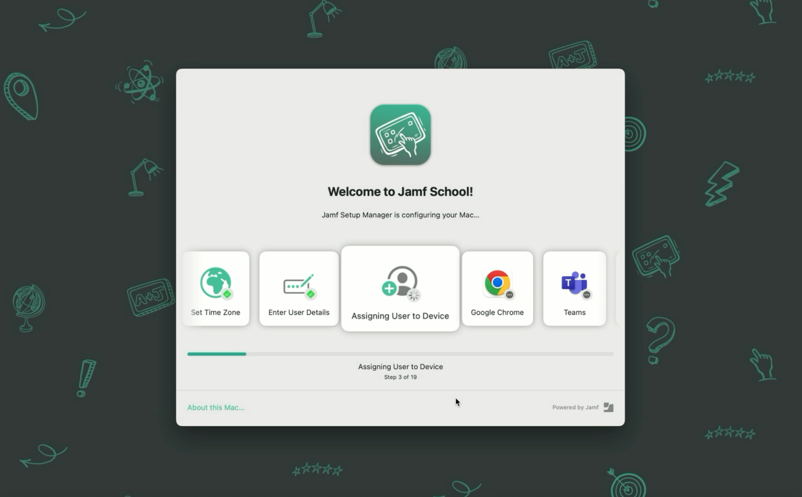
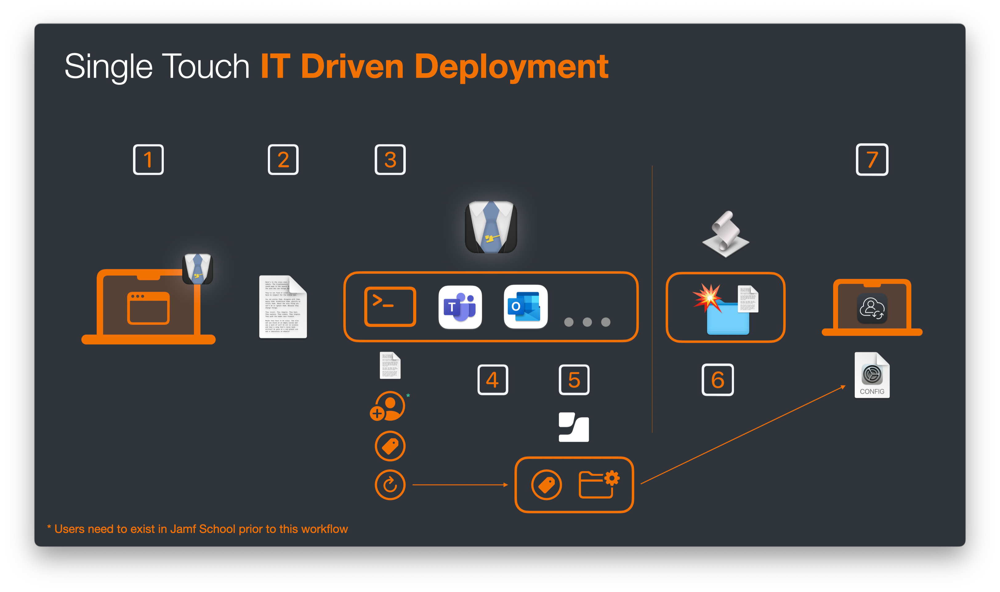

+++
title = 'Advanced Setup Manager Flows in Jamf School, Part 2'
date = 2025-08-09
coverImg = "JSMAdvancedPT2.png"
summary = "In the first part of this blog we looked to power up the feature set of Jamf Setup Manager with Jamf School. Using this as a foundation, in the second part we'll create a Single Touch IT Driven workflow perfect for any IT dept providing a white glove service for their end users"
tags = [ 'Workflows', 'macOS', 'Scripting', 'Setup Manager', 'API' ]
type = "blog"
+++

In the first part of this blog, we looked at how we could add the functionally that [Jamf Setup Manager](https://github.com/jamf/Setup-Manager) provides by using scripts delivered with an [Automated Device Enrollment package](https://learn.jamf.com/en-US/bundle/jamf-school-documentation/page/Automated_Device_Enrollment.html) and how to access the Jamf School API within these scripts. 


If you've found yourself here without first reading [part 1](https://cantscript.com/posts/advanced-setup-manager-flows-in-jamf-school/), I strongly recommend going read this before continuing 


By the end of the last blog I'd covered the ins and outs of using the Jamf School API within scripts, things you will want to consider from a security point of view and what we can do to reduce some risk. However, the only endpoint that we'd considered was the `refresh device` endpoint, as that was a challenge that I had been trying to overcome for a specific workflow. Of course this isn't the only endpoint that might be useful. 

### Considering Jamf School API Endpoints
With the realisation that I could call an API Endpoint via a script as part of a Setup Manager workflow, I started to wonder what other endpoints I could access. Of course the answer to this is _"well **anything** the API provides"_ but that in of itself isn't that useful even if true. So I reframed the question to _"which endpoints are available that could provide quick and easy value to the onboarding process"_, after all Setup Manager is all about the onboarding process.

Theres likely to be others but the first few that came straight to my mine were

- Notes (adding / removing entries to the devices' inventory record under the `notes` attribute)
- Asset Tag (adding / removing entries to the devices' inventory record under the `assetTag` attribute)
- Device Static Group (adding / removing the device to / from a pre-existing static group)
- Owner Assignment (adding, amending or removing the devices' user assignment)

Although the ability to add / remove a device to / from a static group is useful, in my environment I tend to use [smart groups](https://learn.jamf.com/en-US/bundle/jamf-school-documentation/page/Device_Groups.html) almost exclusively, so that didn't appeal to me as much as others. 

I found the notes and asset tag endpoints very interesting since in Jamf School we can use these attributes as criteria in smart groups (there will be more on this a little later).

Without a shadow of a doubt the thing that piqued my interest the most was the owner assignment of the device because, for Jamf Pro, Setup Manager was able to provide a workflow for IT depts to configure the device on behalf of a user, assigning that user as part of the flow but while not needing them to be present. 

That being the key here, the user not being present, the admin still being able to take the machine through the Setup Manager workflow and not needing to actually log in to the device while ensuring that the device is assigned to that user (so that any user specific management is applied)


This is very different from the end user enrolling their own device where we can get the correct user assignment by using an authenticated enrolment. 

Also an Admin not needing to login to the device to see that the onboarding workflow is successful can be super useful for FileVault, Bootstrap or MDM enabled users workflows that revolve around the first user created / logging in. 


### What Is A Single Touch IT Driven workflow?

Before we continue, we should outline what a Single Touch IT Driven workflow is and rather than reinvent the wheel, this is what the Setup Manager documentation states

> In a single touch workflow a tech performs or monitors the initial setup of a device to the point just before the user creates their account. While Setup Manager can run zero-touch workflows, it was built specifically with single-touch workflows in mind.
> 
> A single touch workflow can be as easy the tech unpacking the Mac (erasing it with an MDM command or restoring it with Apple Configurator when necessary), connecting it to network, stepping through the initial Setup dialogs, optionally entering the asset tag or other data, monitoring Setup Manager's process until it is finished and then handing over or sending the Mac to the designated end user who continues the setup and creates their account in Setup Assistant.

As I've now said a few times, this is really useful for admins providing a _"white glove"_ service for their end users. What do I mean by _"white glove"_? well it could mean different things for different people but essentially the reason that IT teams might offer a white glove process

- Younger users who might have problems stepping through the enrolment without supervision
- VIPs - senior leadership or this type of individual who you want to give a special experience too
- Staff member's that don't feel super confident with technology
- Provide additional value for your IT dept / team within your institution 
- For resellers / MSPs to offer as a service so that their customers don't need to worry about any kind of setup, it just lands onsite "ready to go"

This flow can go one step further if you are also utilising Jamf Connect. Again stated in the Jamf Setup Manager documentation 

> You can use a combination of Jamf [School], Setup Manager and Jamf Connect, to get a tighter deployment, user assignment and account creation process. This requires a bit more setup and configuration. This workflow allows the tech to monitor the Setup Manager workflow, enter device specific data such as an asset tag and assign and lock the device to a different user, without requiring the end user's login credentials.

This additional integration with Jamf Connect means that the only person that can login to this device is the person who has been assigned during Setup Manager. Which if you are shipping devices to your end users is another nice "lock down" should the device end up in the wrong hands. 

For this blog, we will be going for this full integration using Jamf School, Setup Manager and Jamf Connect. For the additional Jamf Connect integration you'll want to read my previous blog, [macOS Authenticated Enrolment Passthrough in Jamf School](https://cantscript.com/posts/macos-authenticated-enrollment-passthrough-in-jamf-school/), paying special attention to the section _Additional Jamf Connect Profile_. We'll need this for our workflow here but I wont be going over how to create this profile in this blog. 

    

### Submitting User Data Via Setup Manager

There are a number of steps required to create this workflow with Jamf School covering built in features of Setup Manager, scripts, API calls and smart groups in Jamf School. The broad stoke steps are

- **Step 1**: Configure Setup Manager to Accept Admin Input
- **Step 2**: Parse this input, prepare and make an API call
- **Step 3**: Deliver additional Jamf Connect Profile after user assignment

The first thing that we need to understand is how to configure Setup Manager to accept admin input but just as importantly how this data is stored so that we can access it later in our flow. 


Since there is plenty of documentation around configuring Setup Manager and I covered out to update your current Setup Manager items in part one. Here we'll just talk about the additional keys you will need to add to make use of this workflow. 


The Setup Manager documentation explains the `userEntry` enrolment action but is very focused on Jamf Pro. As such I wont go over the full details of the `userEntry` action but instead show you the configuration that you need for Jamf School and this workflow. This being said, there are some `validation` options that might be useful for your use case which will also work in addition to what I show you, so I do recommend taking a look at the documentation. 

The `userEntry` key is one of 2 extra keys that we'll need to add to our Setup Manager configuration profile. The `userEntry` key is added as a top level key. 

For our usage we need to add the sub-keys `realName` and `email`. Since the term `realName` isn't very clear, I also provided a label and a placeholder. The `userEntry` key in my configuration profile would be as follows




The `subkeys` used relate to a Jamf Pro deployment and its important that the correct key is used so that the Jamf Pro binary submits the correct attribute for the devices. For Jamf School, this isn't the case. We could use any one of the `subkeys` to collect the data, as you'll see later on, we "manually" search for the `subkeys` in a script. Despite this, I would recommend that we use `subkeys` that make sense for the data we are collecting as a best practise (and to make it easier for you or somebody else to understand whats going in on when you've not looked at the flow for months)


The second key that we need to add is an `enrolment action` and is `waitForUserEntry`. This means that the Admin must enter the details and press the 'save' button before any other `enrolment actions` are performed. This can be located where ever makes the most sense in your `enrolment actions`, for me, since its the the point of the IT Driven workflow, I think its important enough to be one of the first actions. The `waitForUserEntry` key in my configuration profile would be as follows _(its important to note that the `waitForUserEntry` key has a value of `string` the value should be empty)_ 




Although technically the `waitForUserEntry` key is not required, since we're going to perform an API call as part of the bigger flow requiring this step to be completed before we attempt to make the API call is just logical and would be a strong recommendation from me.


There is an [example configuration profile](https://github.com/cantscript/Advanced-Setup-Manager-Flows-in-Jamf-School/blob/main/Example_JSM_UserAssignment_WorkflowPt2.mobileconfig) over at my [GitHub](https://github.com/cantscript) in the repo related to this blog but be aware we'll need to create the scripts in the next step before we cover everything in that example profile. 

    

### Parsing User Input For API Call

Adding these keys to the Setup Manager config profile on its own wont do much else than ask the user to enter some details and move on. Remember, since this isn't Jamf Pro, with the binary that can natively update device inventory data, Setup Manager doesn't no what else to do with the data other than just store it. 

The fact that Setup Manager _does_ store that data locally however is a good thing for us, in fact its essential for the next part. 

Whenever the `userEntry` option is used Setup Manager writes this data to a `txt` file located at `/private/var/db/SetupManagerUserData.txt` or `/Users/Shared/SetupManagerUserData.txt` when using debug mode. This means we can take this stored information and using the Jamf School API assign an owner (user) to the device with a script. 

Theres a few things that we need to do within the script. 

- Get the `UDID` of the device as this is needed to identify the device via the API
- Read the `realname` value from the `SetupManagerUserData` file
- Make an API call to Jamf School to get a list of users
- Filter the results to find the `realname` (aka `FullName`) in Jamf School and extract the `userId`, this is needed to assign the user to the device
- Make an API call to actually do the assignment now we have the device `UDID` and `userId`
- Make an API call to `refresh details` so the inventory data in Jamf School is most update to date _(and will be important for the next step, but we'll put a pin in this for the second)_ 

In doing this we'll also build in some error handling so that if anything fails the script fails gracefully and gives some feedback in the Setup Manager log 


Worth noting here that although the script will fail gracefully, the Setup Manager tile will still show as completed with success.


**Get the `UDID` of the device**  
This is a pretty standard line of code and can be gathered directly from the device. It looks something like



**Read the `realname` value from the `SetupManagerUserData` file**  
I've built a function that first checks that the `SetupManagerUserData` is on the device in the known location for standard or debug use and if not provides some logging. 

If the file exists that we try and extract the value from the `realname` line.




You can extract other data out of the file using the same code but changing the `realname` value for something else. If you've followed my guide you wont need to change this but if you used another value or want to expand on what I've done you can.


**Make an API call to Jamf School to get a list of users**  
With this information in hand we can make an API to Jamf School to list the users in the system and then filter out the user that we are looking for to extract the `userId`. _We need this step as you cannot assign a user via the API with a `FullName` or `username`, it must be the `userId`_


To make things easier here I've used `jq` which comes shipped with macOS since `macOS15`. If you are running devices before `macOS15` if you wish to use the example as is you'll need to [install jq](https://jqlang.org) 'manually'


If the user isn't found then we provide and error and log



Its at this point that I should point out some things that I've glossed over until now. Generally speaking its at this step that you'll have the most chance of things going wrong, failing and providing an error. Thats not to say we can't do thing prevent this from happening _(or at least way less regularly)_ more over I've just been lazy when providing you with an example script! Here are some things to consider....


This whole workflow requires that the users you are assigning to the devices are already synchronised into Jamf School. Now theres a whole heap of things that I could spend multiple other blogs writing about when it comes to importing users but if you're users are already in Jamf School, cool! If not and you need a helping hand to get started I suggest watching my JNUC session from 2024 called [Scaling Success - Mastering Large-Scale Jamf School Configuration](https://youtu.be/ET0AxMAB3wY?si=VlyJMh_-YeZ_Tnhw&t=1313) _(from around 21:53 until the end)_



The `userEntry` form is susceptible to human error, aka typos! (I should know, I don't think I've released a blog post yet without at least one in it). If I were to enter a persons incorrectly, the whole thing fails!

We also ask for the users `realname` _(or `FullName`)_ and `email` in the form but in the script I don't actually do anything at all with the email address in terms of validation. I only search for the matching `realname`. 

To reduce the errors brought on by typos you could (and most likely should) also use the `email` address you captured and filter for the user on that as well. You'd then likely match if `realName` *_OR_* `email` address is matched _(whats the likelihood you'll make a typo in both entries?)_

To harden this you could (and again probs should) use the `endUsername` key in the config profile and enter a users `username` as well and then add this to your matching logic (or completely replace `realname` with `endUsername` incase of users with the same full name)

If you add this in the same function then you will only still need to make the API call once even though you might quiz the data multiple times.   



Finally, to really mitigate errors as much as possible, within the Setup Manager config profile the `userEntry` key does allow for some [regex validation](https://github.com/jamf/Setup-Manager/blob/main/ConfigurationProfile.md#validation) so you can ensure that the email domain is valid or that a username must be firstIntial.lastName etc etc  


**Make an API call to do the Assignment**
With all of the information in hand we can now to the user assignment via the API



**Make an API call to `refresh details` of the Device Inventory**
You'll notice this is a very similar call to the above but is something that must be done after the assignment 



**Full Script**
I've highlighted the main elements of the script but to run them like this wouldn't give you the result you needed. I've included a [full script example on GitHub](https://github.com/cantscript/Advanced-Setup-Manager-Flows-in-Jamf-School/blob/main/EnrollmentPkgPackager/payload/Library/Application%20Support/JamfSetupManager/assignUser.sh)

This script should then be added to the package that you deliver to the device in your Automated Device Enrolment Package and the Setup Manager configuration Profile should point have an `enrolment action` with a `shell command` pointing to this script directly after your `waitForUserEntry` action (See the full [example configuration profile](https://github.com/cantscript/Advanced-Setup-Manager-Flows-in-Jamf-School/blob/main/Example_JSM_UserAssignment_WorkflowPt2.mobileconfig))

    

### Deliver Additional Jamf Connect Profile After User Assignment

Without doing anything else an Admin could enrol the device and assign it to the end user. In this case after Setup Manager has finished you'd likely have Setup Assistant ask the user to create a local user account. At this point the Admin could shut down the machine, box it up and ship it out to the end user. All they'd need to do is turn it on, follow the remaining setup assistant steps and they'd be up and running, all with the apps they need installed. 

However, if you are using Jamf Connect, we can make this experience even more customised, tighter and secure (since the only person that can login to this device is the intended end user, even if its somebody else from you school that receives the device). 

    

As I pointed out towards the start I'm not going to go over the Additional Jamf Connect Profile, how it works or what you need _(see the [previous blog](https://cantscript.com/posts/macos-authenticated-enrollment-passthrough-in-jamf-school/) for that)_ but instead how to deploy it within the context of this workflow. 

Within the script above there is one final API call that I make which sets the devices `assetTag`, this then adds the device into a smart group, which in turn deploys the additional configuration. 



Its important that the profile doesn't get delivered to the device until after the user assignment has happened since it uses Jamf School variable's and with no user assignment _(If the profile got delivered after enrolment but before the user assignment for example)_ the profile would just use that standard variable tokens. 


I have a previous blog on the topic of [Jamf School Variables](https://cantscript.com/posts/using-jamf-school-variables-in-scripts/) if this is something that is new to you


As well as the extra API call within the script, we'll need to do some work in the Jamf School console and set up a Smart Group that looks for a certain value in the `assetTag` field of the device inventory. You'll notice that in the example I use the value of `User Details Entered` and this is what will build the Smart Group on. You can use whatever value you like and adjust the Smart Group accordingly. 

To configure the Smart Group log in to Jamf School and navigate to 

- `Devices` -> `Device Groups` -> click `+ Add Group`
- Name the profile (I went with "Jamf Connect Enrol User Details") -> click `Smart Group`
- Navigate to `Profiles`, choose your Jamf Connect Additional Profile and choose `Automatic`
- Navigate to `Members` -> `+ Add Filter` and select `Asset Tag`, `equals` and then type `User Details Entered`
- click `Save`

With this in place once Setup Manager finishes and any additional Setup Assistant panes are completed you will see the Jamf Connect Window asking for the password (and only the password) of the assigned user and only that user can log into the device for the first time. 

As an admin we are in the same position as before we've enrolled the device, ensured it has all the apps we need, assigned it to the user and once its at the Jamf Connect window we can turn off, box up and ship to our end user. 

---

    

1. Jamf Setup Manager has `enrolment action` `userEntry` and `waitForUserEntry` enabled
2. Admin enters end user details, which are written to local file. Setup Manager holds here until user entry is complete
3. Script is called which parses data from local file, makes API calls to retrieve `userId`. Assigns user to device, writes a value to the `assetTag` attribute and triggers a `refresh details` via API
4. Jamf Setup Manager then performs the rest of the `enrolment actions`
5. Concurrently, due to the API calls performed at step 3, Jamf School recalculates Smart Groups. Device falls into group targeting `assetTag` value of `User Details Entered` and delivers additional Jamf Connect Profile
6. Once Setup Manager has finished an additional and final script is trigger which deletes the central script location so that they are no longer on the device
7. The user lands on the Jamf Connect login window, displaying the assigned users name and asking them for their password. The device is ready to use

---

###Additional Details: Additional Jamf Connect Profile After User Assignment 

**Using The Asset Tag Device Inventory Attribute**  
This flow requires the `assetTag` device attribute which might be a problem if you already use the `assetTag` for other purposes in your environment. 

If this is the case you can instead use the `notes` attribute in the same way since you can build a Smart Group using this attribute just as you can with `assetTag` and the API call to write data here is almost identical. 

If you are also using the notes field already, you can still use this flow but it requires a little more work _(and testing for robustness)_ where by you add this additional data to the existing data. When you add to either of these attributes using the API it over writes what is already there. Therefore if you want to add the `User Details Entered` text as an addition you would need to

- Read any data already in the `assetTag` or `notes` attribute via the API (which is given by default with the GET devices endpoint)
- Append `User Details Entered` to whatever data is already there
- Make the API call, writing the new string which includes `current data`+`User Details Entered`

Prior to this you will need to amend your "Jamf Connect Enrol User Details" Device Smart Group so that the criteria now states `contains` and not `equals`. This would also be the case for any Device Smart Groups you have configured that makes use of the "current data" as a criteria. 

I said it already but once more.....if using this "appending" method, _test_, **Test**, _**TEST**_

**Do I need to Have Entered an Email Address at User Entry?**  
Remember above how I said that in my example I don't actually use the information collected in the `email` value from the `userEntry` _(while remembering I said you should for validation)_?

If you've also read the blog about the Additional Jamf Connect Profile you'll have seen that you _**DO**_ need to provide the email address. 

So whats the deal!? Do you need it or not?

Simply, you _**DONT**_ need to collect it for this profile (although again, you should for filtering out the user and validation). The email address to populate this profile is pulled from the user record in Jamf School, so it is important that this record does have the correct IdP corresponding email. 

Which then leads me to....

**Typo Trouble**  
As I said before typo's can lead to users not being found, matched ad assigned to the device. In the workflow without the Jamf Connect pre-filled details in the mix, this might lead to a device not assigned to a user _(which in turn might lead to some missing apps or config)_

If there is a typo in which leads to an incorrect / no user assignment with this extra Jamf Connect piece in play, you'll end up at a Jamf Connect window that is asking for a password for a user called `%FullName%` and an email of `%Email`. Clearly your IdP wont have a user with these details and you'll be stuck. Remember, with this profile in place _THE ONLY_ person that can log in for the first time is this pre-filled user. 


This then makes all my points about ensuring that there is proper user validation in the "assign a user" script even more important. 


**Device Re-enrolments**  
Theres one thing final thing about this flow if you are using the extra Jamf Connect piece and thats around re-enrolments. Since we've written to the `assetTag` attribute its worth knowing that this persist with a re-enrolment, this means the Smart Group looking for the `User Details Entered` will pick up the device as soon as its enrolled again. 

Only, we only want the the additional Jamf Connect profile to land on the device _after_ user assignment to prevent the default variable tokens. 

As such my recommendation was going to be _(hang on there)_ when wiping devices and enrolling them, ensure that you are also removing the `assetTag` value either via an API _(which you could also add a wipe device command to as well, to automate both actions)_ or the console.

However, that was **_going to be_** the advice.

Turns out through my testing, I've had times when I've forgotten to do this and everything has still worked and I believe this is because of the `refresh details` API call that I make in the "assign user" script. 

Yes, on re-enrolment the additional Jamf Connect profile will either land on the device after enrolment with either the previous users details or the default variable tokens (depending on your environment setup) but once the new user assignment happens via the script and the `refresh details` is completed, Jamf School understands there has been a change of values in these attributes and re-issues the Additional Jamf Connect Profile with the most current variable values (the user you've just assigned). 

Since Setup Manager will have many other `enrolment actions` _(providing you do this towards the start of your flow, which I highly recommend)_ the device has plenty of time to receive the updated profile before landing on the Jamf Connect window. 

Which method should you take? _test_, **Test**, _**TEST**_! From my testing both work but you should test in your environment and figure out which is best for you.


As I sit here writing this, I've realised its also entirely possible I've seen this behaviour (without needed to removed the `assetTag` value) as I've used the same user on re-enrolment and as such its just "worked like magic". So again, please test before deciding which route you should use. 


### To Wrap Up Part 2
After reading this part you might be sitting there thinking theres a lot of extra work to get this stood up and / or theres a lot of point where this potentially could go wrong. 

I'd struggle to disagree with both of these because this extra part of the puzzle described here wont be for everyone who uses Setup Manager. You're "worth it" workflows were all in [Part 1](https://cantscript.com/posts/advanced-setup-manager-flows-in-jamf-school/)

However....

If your environment requires this single touch IT driven workflow I will say with some certainly that this extra work is minimal compared to the time and effort you currently have to put in to "white glove" the onboarding. Remembering as well that once you've got your script tuned in (80% of it is already in the example, you really only need to work on the validation part based on my recommendations) the extra work is done and you are "banking cash" with every device you onboard after that. 

If you're in the "could go wrong" camp, remember these few things. I was lazy with my script and didn't deal with any validation, which in a production environment I 100% would. With the validation in place, 90% of the "could go wrong" parts fizz away. It will be IT professionals, your IT crew, that will be running through the Single Touch IT Driven workflow, these are people you trust. Explain to them the importance of making sure things are spelt correctly. This carefulness along with validation in the script will go along way to making this a success. 

Finally, if things do go wrong, as long as its not on every device onboarding _(in which case it suggests something else and bigger is wrong anyway)_, its not the end of the world. 

Lets say that you get to the Jamf Connect screen and it says the wrong user

....as I'd hope the admin / IT professional checks this before boxing the device up or handing it out...

You wont need to nuke and pave, simply logging into the Jamf School console, assigning the device to the correct user, performing a `refresh device` and allowing the device to check in, will fix the issue. 

Again, the things discussed in part 2 wont be for everyone and thats completely fine, don't worry about it but keep it in mind as one day it might just be the solution you need. 

### Final Thoughts
Across the last 2 blogs we've discussed advanced workflows we can perform with Jamf Setup Manager and Jamf School. At times we've "coloured outside the lines" to get the results we needed but if your environment allows you to do so, we've added a a feature set that gives you and your team a power house of an already crazy good onboarding tool and flow. 

Regardless of if end users are onboarding their own devices, you're an IT dept onboarding devices for your Teachers, Students or VIPs or you're a reseller / MSP provide a service for your school customers, we've got something in these advanced workflows for you. 

Now if only some of the things we've discussed here specifically with how Jamf School works were baked into Jamf Setup Manager. If only I knew the guy that made it 😉

We can hope, right 🤞🏼