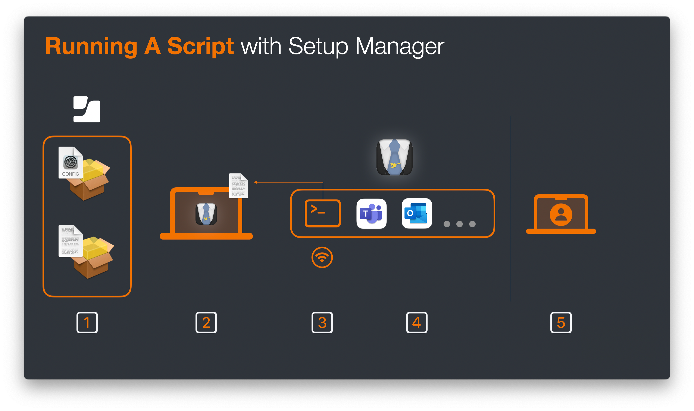
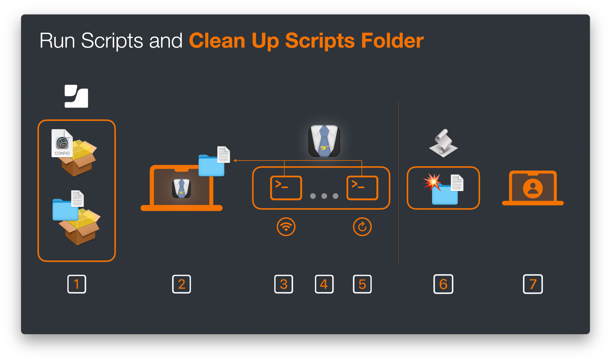

+++
title = 'Advanced Setup Manager Flows in Jamf School, Part 1'
date = 2025-07-26
coverImg = "JSMBanner.png"
summary = "Jamf Setup Manager powered up macOS deployment workflows for Jamf School but what happens when you power up the power up? In this blog we look at some advanced Setup Manager workflows aimed specifically at Jamf School"
tags = [ 'Workflows', 'macOS', 'Scripting', 'Setup Manager', 'API' ]
type = "blog"
+++

Hopefully by now most people in the Apple-Jamf community will have heard, seen or tested Jamf Setup Manager. If you've spoken with me anytime in the last 18 or so months about macOS and Jamf School, you'll know it's a staple of my Jamf School onboarding flow. 

Just incase you've not come across Jamf Setup Manager yet, in a nutshell its a macOS onboarding tool that can be ran at the Setup Assistant fundamentally changing the flow mac Admins have been using for years. Instead of turning on a device, having it enrol into MDM, configuring a local user, landing on the desktop and then providing a hold screen for the end user while we install all the apps needed; Setup Manager instead allows us to hold the user right after enrolment, meaning once the user is at the desktop they are ready to go. 


For more information about Jamf Setup Manager in general, visit the [GitHub repo](https://github.com/jamf/Setup-Manager). For more information about Setup Manager and how to use it with Jamf School, I recommend the second part of a blog I wrote on jamf.com: [Part 2: Customize your onboarding experience with Jamf Setup Manager](https://www.jamf.com/blog/part-2-customize-your-onboarding-experience-with-jamf-setup-manager/)


### The State of Play
As I sit here and write today, Setup Manager is on version 1.3.1 and although there has been a number of advancements in just a few versions, one thing has stayed the same. The actions that you can perform with Jamf School and Jamf Pro are different. Now this is fine because it boils down to the fact that Jamf Pro is built differently to Jamf School and fundamentally these differences stem from the fact that Jamf Pro deploys a dedicated binary for macOS, and enables additional functionally over MDM. 

Now, this is all important for us to understand before we dig into the advanced workflows because without this context we don't know what we are aiming for. 

Thanks to the Jamf Pro Binary here are a few things that we can do extra with Jamf Setup Manager when using Jamf Pro _(this might not be the extensive list, but they are the things you need to know about to follow along with the rest of the blog)_

**1) Call A Policy**  
Jamf Pro has a concept called Polices. These are actions that go beyond MDM, there are many but the ones to focus on here are to _run a script_ or _install a package_ at a given trigger or on demand. Due to the ability to call a policy on demand, Jamf Setup Manager is able to invoke a policy in a programatic way. For example do X before calling policy Y _(which maybe runs a script that is related to X having been completed first)_.

**2) Update Device Details**  
The Jamf Pro binary enables admins to use the command line to update device details. Again theres a host of things but think user assigned to the device, the asset tag, a department, the name of the device etc etc. Things that show up as part of the device inventory data about the device but not necessarily directly related to management items. Since the binary can be invoked via the command line for these tasks Jamf Setup Manager can update the inventory data for the device in the Jamf Pro device record. 

In part this then enables.....

**3) A Single Touch, IT Driven workflow**  
Here we need to put ourselves in the mind of an IT professional who sets up a device on behalf of the end user and then maybe ships it off to them somewhere else on the planet (or in less exotic cases, the users desk). 

The Single touch IT Driven workflow enables the admin to enrol the device, ensure that all essential items are installed and assign the device to the correct end user all without ever needing to actually log into the device. 

If you are in an environment where your end users aren't setting up their own devices or are an MSP of some kind this "white glove" flow is a nice service to have. 

Maybe you're now finding yourself asking the question so what can be done with both Jamf School and Jamf Pro. Im glad you asked....although the above is specific to Jamf Pro, both Pro and School can perform the below essential `enrolment actions`

- Install apps using Installomator (which is built into Jamf Setup Manager)
- Check to see if a file exists in a file path (known as a watch path)
- Present a user with a wait tile for a given time with customized text and icons
- Run a shell command (a single line of code, as if ran in terminal) 

With these 4 `enrolment actions` alone and thanks to advancements in Jamf School in the form of ["ADE Packages and Profile"](https://www.jamf.com/blog/apple-automated-device-enrollment-jamf-school/) late last year, we can already majorly power up an macOS deployment. 


Im not going to go into the benefits and how Jamf Setup Manager powers up macOS deployments here since I want to take the time to talk about the next steps, powering up the power up. However, [this post](https://www.linkedin.com/posts/anthony-darlow-a795b294_jamfschool-automateddeviceenrolment-jamfpro-activity-7275586073324314627-_vit?utm_source=share&utm_medium=member_desktop&rcm=ACoAABQFin0BPjEEXy3h1hmscBfGXhw7hZzLHXQ) pretty much sums up how awesomely simple it can be for an end user


### The Problem that Inspired the Solution
With that "level setter" and background knowledge out of the way, lets actually talk about how I got to working on these advanced workflows in the first place and what these advanced workflows actually are.

**SPOILER ALERT**: They are the extra things that we can do with Jamf Pro that I mentioned above, even if indirectly 😉

I've had recent interaction with an admin in an education environment using Jamf School. They already had a successful iPad deployment and were moving forward with their macOS fleet. They had created a macOS onboarding workflow but were coming up against some issues, I wont go into the full detail but there were two things we ended up tackling with Setup Manager. 

**Issue 1:** The need to run a script at a chosen time  
**Issue 2:** The need to update the device inventory at the end of Setup Manager flow

Now looking at the above you'll quickly be able to see that if the admin was using Jamf Pro and Setup Manager, these are out of the box solutions. 

Lets be clear on the actual issues. 

**Running A Script**  
We can run a script with Jamf School as long as you have enabled the [scripting module](https://learn.jamf.com/en-US/bundle/jamf-school-documentation/page/Scripts.html). Once you have added a script to Jamf School, there are a number of triggers to run the script from `once` (which runs the script pretty much right away) to `on a schedule` or to `login`.

The issue here was that the admin required to run a script at a specific time, as an `enrolment action` and complete the task in the script (which for reference was WiFi / Network related) before moving onto the next `enrolment action` and continuing the the onboarding flow. 

With the in product script actions this just simply isn't possible.

**Update The Device Inventory Data**  
Again its not like the device inventory data cannot be updated. Its updated in a number of ways and times

- Its updated when the device checks in (which is once every 4 hours, at time of writing)
- An admin can manually `refresh` the device through the console
- Users can initiate a `refresh` of their device through the Student or Teacher app
- An API endpoint is available to `refresh` the device and update the inventory data

However, it cannot be done programatically like with Jamf Pro and the binary. 

Ultimately both problems stem from not being able to call actions programatically or at will within the Setup Manager `enrolment actions`. 

### Colouring Outside The Lines
Knowing that I wasn't able to perform these actions, I sat down and started to think. I knew that I had to think differently and, as I like to call it "colour outside the lines". Essentially use Setup Manager in a way that perhaps wasn't intended but will still get the results. 

With the first issue in mind, that of running a script programatically, I looked at the `enrolment actions` that I did have available in Setup Manager. `Installomator` or a `Wait Tile` wouldn't be any use, neither really would a `Watchpath`. So then the only other option that was available was a `Shell Command`. 

A `Shell Command` is just a single command, yes it can have options and flags but its not a script, with variables and logic, running command after command. You cannot just add all the lines of a script (and in this case it was 50 or so lines in the script) to a single or even multiple `Shell Command` `enrolment action`.

However, I can use a shell command to run a script that is already located on the device. As admins we do this all the time in terminal, something like 

`/path/to/script/MyScript.sh`

This of course requires the script to be on the device, which it wont be at enrolment....

...Hang on....

Thanks to the `Automated Device Enrolment Packages & Profiles` feature that was added to Jamf School, I **can** add packages to the device **AT** enrolment, meaning they are on the device by the time Setup Manager is running; and if we package the script and add it as an `Automated Device Enrolment Package`, I can use the `Shell Command` `enrolment action` to run the script when I need it, just like calling a policy with Jamf Pro. 

Bingo! Now the admin I was working with can run the "WiFi checker" as the first `enrolment action` and thanks to the logic in the script, it holds the device at that action until the script is complete (ie, the device is on the correct network) before moving on to downloading and installing other software. 

As I always say, when it comes to scripting your imagination is the limit. The admin in question needed to run a script in their environment that checked some WiFi & networking conditions as the first action but maybe you have a requirement to run a script half way through your onboarding flow, or after a certain software title has installed. 

My point here is, it doesn't matter what the script does, we now have a way run a script whenever we need, in a given order, at a specific time.

From a configuration point of view, these are the steps to take to create a similar workflow

**Step 1: Creating A Package Containing a Script**  
Lets assume that you have a script already in hand, we will need to package it up. The first consideration to make is where to locate the script in the first place. Realistically this could be anywhere you want. It could be the system `tmp` folder or the `/Users/Shared`, however, as you'll see later, you might want to be a little bit more targeted and thoughtful in this placement. 

As such, my suggestion is that we store the script in `/Library/Application Support/JamfSetupManager`

To create a package use a tool like [Jamf Composer](https://www.jamf.com/products/jamf-composer/) (which as a Jamf School Customer you should have access to through Jamf Account) or you can run script to tackle the packaging. 


I've added an example and [simple script on GitHub](https://github.com/cantscript/Advanced-Setup-Manager-Flows-in-Jamf-School/blob/main/EnrollmentPkgPackager/EnrollmentPkgPackager.sh) for packaging the scripts but I must say that if you want to learn more you should check out Armin Briegels ([scriptingosx](https://scriptingosx.com))[Packaging For Apple Administrators](https://books.apple.com/gb/book/packaging-for-apple-administrators/id1173928620) book. It could do with a bit of an update but the fundamentals are still there and I learnt so much reading this book. 


Regardless of how you package your script, once you have it, you can move on to step 2

**Step 2: Upload Package to Jamf School**  
Log into Jamf School and navigate to 

- `Apps` -> `Inventory` and click `+ Add App`
- Choose `Add In-House macOS Package`
- Navigate to your `<MYSCRIPT>.pkg` on your machine and drag to the Jamf School window
- Once uploaded click `save`

**Step 3: Add Enrolment Action To Your Setup Manager Configuration Profile**  
Again Im going to assume that you have a Setup Manager configuration already. If not you can simply add the `enrolment action` as you build out your Setup Manager configuration profile. 

Since you cannot edit an existing 'custom profile' in the Jamf School console you will need to edit your original profile or download from Jamf School. In both cases you'll also need a tool for editing, this could be something text based like [BBEdit](https://www.barebones.com/products/bbedit/) or [Coderunner](https://coderunnerapp.com) or something most specific to creating preferences such as [PlistEdit Pro](https://www.fatcatsoftware.com/plisteditpro/).

You will know in your workflow where you need to run this script but for my example I want to run as script as the first action. Therefore in my configuration profile I will add the following key/values.




Its important that you list the location of your script in the `shell` string if you did not follow my suggested location


Once you've added the `enrolment action` to invoke your script, save the configuration profile. 

**Step 4: Upload The Updated Configuration Profile to Jamf School**  
Again, assuming that you already have a Jamf Setup Manager configuration profile in Jamf School and you are updating your configuration (if not, and this is your first upload of a Setup Manager configuration, use the Jamf Setup Manager [Quick Start Guide](https://github.com/jamf/Setup-Manager/blob/main/Docs/JamfSchool-Setup.md)).

- Navigate to your Setup Manager Configuration in the `Profiles` -> `Overview` menu 
- Click in the `name` of the profile (or the `pencil icon`)
- Click `replace profile`
- Drag or choose your updated profile and click `upload`
- Once uploaded click `save`

Replacing a custom profile like this does not require you to  
A) Edit the payload UUID  
B) Rescope the profile in any places it was already scoped

**Step 5: Edit Automated Device Enrolment Profile**  
Once again, assuming you already have a Setup Manager workflow in place you will need to add your newly uploaded `<MYSCRIPT>.pkg` to the ADE profile ((if not,, and this is your first upload of a Setup Manager configuration, use the Jamf Setup Manager [Quick Start Guide](https://github.com/jamf/Setup-Manager/blob/main/Docs/JamfSchool-Setup.md)).

- Navigate to your ADE profile used for your Jamf Setup Manager workflow in the `Profiles` -> `Automated Devices Enrolment Profiles` menu
- Click `Profiles and packages`
- Under `In-house macOS packages` click `+ Add`
- In the drop down menu search / find your `<MYSCRIPT>.pkg`
- Click `save`


You will not need to add / or replace the Setup Manager configuration Profile if you updated it as mentioned in the step above. However if you created a new Profile (for testing purposes for example) be sure you select the new Profile here as well as paying attention to the info banner in console regarding scoping.


With that all in place you are ready to test your flow and call a script whenever you required. Since Jamf Setup Manager is what calls the script, unless handled and redirected in the script, any output the script produces (such as an `echo`) will be found in the Setup Manager log. 

---

    

1. Add Setup Manager pkg & Configuration Profile and packaged script to ADE profile in Jamf School
2. Setup Manager and the script pkg is installed during enrolment
3. Setup Manager `enrolment action` uses `shell` and and points to the script location and runs the script
4. Setup Manager continues with all other `enrolment actions` and closes
5. Device is ready for user to log in and start to use the device

---

### Forget Colouring, Lets Take A Big Thick Marker To The Page
So far thats one of the items ticked off, programatically running a script. It still left the need to update the devices inventory or `refresh device` as we know it in Jamf School.


So here is the warning before we go any further, the big thick marker scribbling over the page as it were. What Im about to say next will polarise people. It'll be down to you if the benefits outweigh the concerns. Don't say you weren't warned...


Remember these are the ways we can perform a `refresh device`

- Its updated when the device checks in (which is once every 4 hours, at time of writing)
- An admin can manually `refresh` the device through the console
- Users can initiate a `refresh` of their device through the Student or Teacher app
- An API endpoint is available to `refresh` the device and update the inventory data

The first three clearly aren't designed to be automated at all but the whole idea of an API endpoint is just that, automation and triggering that action from an external source. 

How would you automate and hit an API endpoint? A script would be most peoples first call....and haven't we just figured out that we can run a script at a given time with Setup Manager? Why, yes we have. 

So we can write a script that interacts with the Jamf School API, which we can then run using an `enrolment action` as the last step of the flow. Now we also have a way of performing a `refresh device` at a given time too. Problem solved!

If you're new to the Jamf School API heres an example of a simple script to perform a `refresh device` and its also able over on my [Github](https://github.com/cantscript/Advanced-Setup-Manager-Flows-in-Jamf-School)



Okay, this is where I can imagine some people screaming at their screens reading that Im suggesting we run API calls from our end users devices! Mainly due to the script most likely (and most certainly in my case) having API credentials in plain text in the script. 

Yes, I hear you but....theres a few things I'll point out 

Firstly, we're talking students and teachers onboarding devices. Our students are kids, how many of them are really trying to mine data from their school devices?! (I'm sure there are some, lets be real) We're talking education environments, not a highly regulated industry like FinTech. 

Secondly, these scripts are ran during setup assistant. By an app thats designed to take over the whole screen and stop a user from interacting with anything other than the Setup Manager screen. Thats a lot of work for your average "not bothered" student to have to figure out how to get around, should they even realise theres some scripts nestled away on the file system performing API calls.

Thirdly, as you'll see in the next section. Im not suggesting that we don't mitigate some risk as part of this process. 

Ultimately though, its your choice. In many cases I believe that the ability to perform these extra actions (particularly those that we'll cover in part 2) during setup out weigh the risk or problem of an end user device performing API calls. However I also completely understand in other cases Admins simply wouldn't be able to consider this due to policy set in their environments. 

### Time To Shred The Page, Clean up and Reduce Risk
As I suggested above there is still actually one last step that we should perform in order to be "good Admins". Its all very well and good me suggesting the scripts are ran during Setup Manager, where a user can't simply get at the file system but **keeping** the scripts on the device **after** Setup Manager and once the user has easy access to the file system, thats craziness!

**Central Script Folder**  
So that I don't make assumptions, before we talk about clean up. Lets just go over the configuration you'd need to go through in order to run multiple scripts during Setup Manager. To sick with my example I want to run my `Wifi Switcher` script as my first `enrolment action` and then update the device inventory data by running a `refresh device` script as the last `enrolment action`. 

What we **_wouldn't do_** is create a package per script (imagine if you had 5 or 6 scripts you wanted to run! You'd also quick run out of slots in the ADE profile in Jamf School, which is limited to 5 packages). Instead there was a reason that I suggested that you created a central location to store the scripts.

`/Library/Application Support/JamfSetupManager`

You can simply add all the required scripts into this folder and then call the required script at the right time in your Setup Manager `enrolment action`. Take a look at my example Setup Manager [Configure Profile on GitHub](https://github.com/cantscript/Advanced-Setup-Manager-Flows-in-Jamf-School/blob/main/Example_JSM_Advanced_WorkflowPt1.mobileconfig). 

Once you've added all the required scripts to that location you'd need to create a new package / configuration profile and follow the same steps as above. 

**Clean Up**  
Now we have just a single folder that contains these scripts that potentially include sensitive data that is actually in a location that a user can browse to and potentially read data from. _(remembering in this case Im talking API credentials for the `refresh device` call but in reality any script you run could have data you wouldn't want your users stumbling across)_. 

However the fact that we do have that single location also makes the clean up super easy! We just need to delete that folder once Setup Manager has finished. 

The good news is, since `version 1.3` [Setup Manager](https://github.com/jamf/Setup-Manager/tree/v1.3) has included a feature that will run one last script once the Setup Manager process has finished.

> `finishedScript`
> 
> (String, optional)
> 
> A full path to a script file which will be executed after Setup Manager has finished its workflow. This process runs independently of Setup Manager, so it can run installers or scripts that affect Setup Manager.
> 
> The script has to fulfill these criteria to be executed:
> 
> - owner: root, group: wheel  
> - executable bit set  
> - not writable for group or other (file mode 755 or 555)  
> - no quarantine flag attached  
> 
> The output of the finished script and trigger will be logged to /private/var/log/setupManagerFinished.log.
> 
> Example:
> 
> `<key>finishedScript</key>`  
> `<string>/Library/Management/finishedScript.sh</string>`

Previous to this Armin had written a [stand alone tool](https://scriptingosx.com/2025/01/run-a-script-when-setup-manager-is-finished/) to perform this action and so can still be achieved if for some reason you have not or cannot move to `version 1.3+`

To use this action add the above `finishedScript` key to the top level configuration (see [example Setup Manager Configuration Profile](https://github.com/cantscript/Advanced-Setup-Manager-Flows-in-Jamf-School/blob/main/EnrollmentPkgPackager/EnrollmentPkgPackager.sh)) and point it towards your last script. I would suggest that you call it `finishedScript.sh` and of course it should be located in our `/Library/Application Support/JamfSetupManager` folder. 

The contents of the script is just a simple deletion of the `/Library/Application Support/JamfSetupManager` folder




Since this script requires certain criteria in order to be executed in the [example package builder](https://github.com/cantscript/Advanced-Setup-Manager-Flows-in-Jamf-School/blob/main/EnrollmentPkgPackager/EnrollmentPkgPackager.sh) script that is on GitHub I set the permissions prior to running the package command. This could however also be done as a `postinstall` action


Now, once Setup Manager has run all the `enrolment actions`, that can now include scripts and API calls, has finished this last script will run to remove the folder with any scripts we used. _(includes sensitive data in them such as API credentials.)_ 

---

    

1. Add Setup Manager pkg & Configuration Profile and packaged script to ADE profile in Jamf School
2. Setup Manager and the script pkg is installed during enrolment
3. Setup Manager `enrolment action` uses `shell` and points to the script location and runs the first script
4. Setup Manager continues with the `enrolment actions`
5. Setup Manager uses another `shell` action, again pointing to the script location but is targeting a second script, with an API call to refresh the device
6. Once Setup Manager has finished an additional and final script is trigger which deletes the central script location so that they are no longer on the device
7. The user lands on the login window and device is ready to use

---

### To Wrap Up Part 1
Again I must stress, running API calls from an end users device might not be for everyone. You must make your own mind up if this is something you can or should run in your environment. 

We do however reduce the risks of end users being able to access the scripts that contain API credentials and by the time a user could snoop around to look for them, they are long gone. 

Also consider the benefits these additional flows can bring and add this to any justification or decisions you make. 

In part 2, we'll look further into this API concept and what other advantages it brings, which includes the IT Driven, Single Touch workflow that will allow IT Admins to provision devices for their users whilst still harnessing the benefit and power of Jamf Setup Manager.

