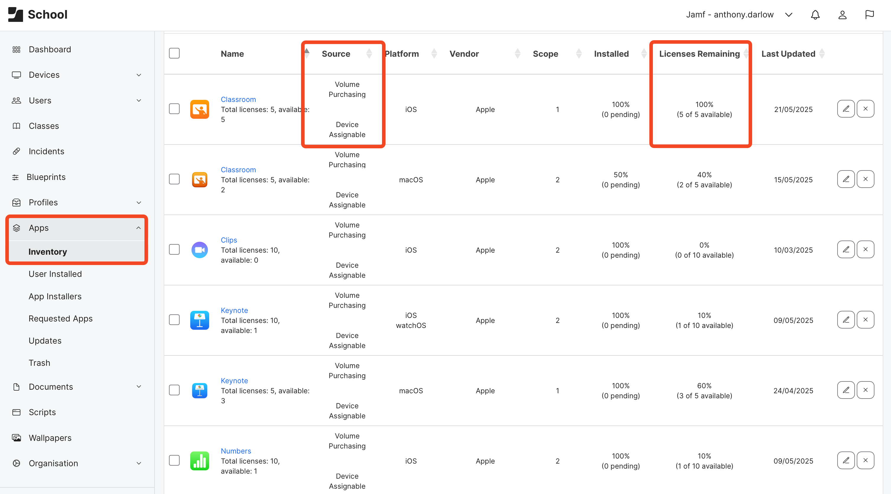
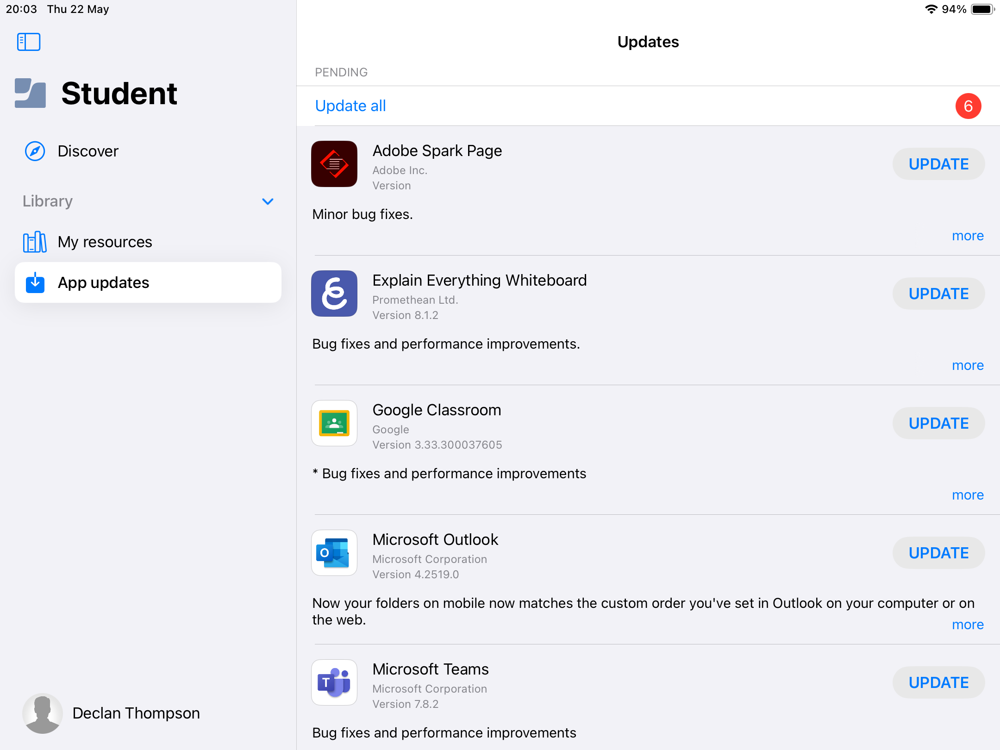
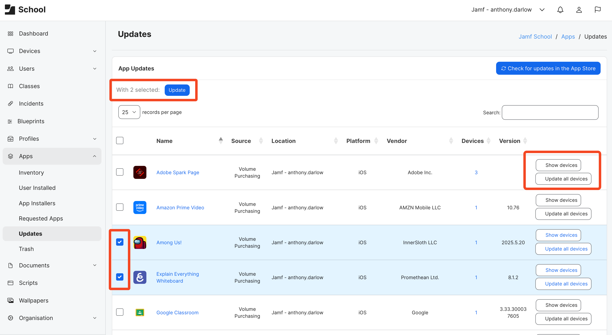
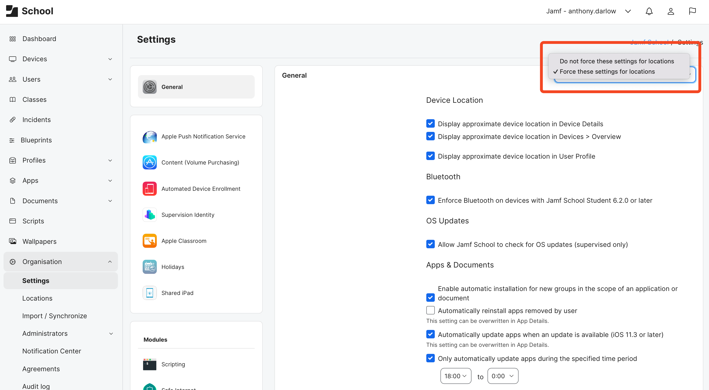
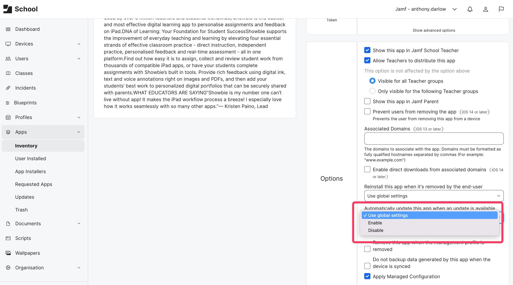
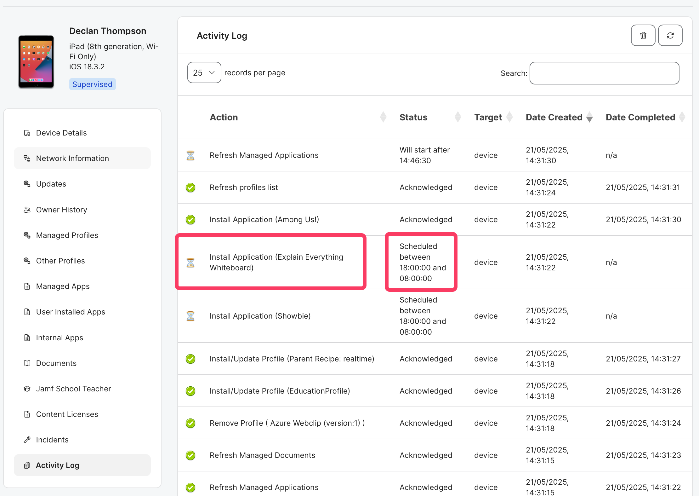

+++
title = 'Automatically Updating VPP Apps'
date = 2025-05-22
coverImg = "updatescover.png"
summary = "Keeping your VPP (Apps & Books) Apps up to date can be as simple as a check box in Jamf School but lets look at what to expect when using the `Automatically Update Apps when Available` Option"
tags = [ 'Workflows', 'Apps', 'VPP' ]
type = "blog"
+++

Let's get one thing out of the way, I know the term I should be using is "Apps & Books in Apple School Manager" and not VPP; but lets face it, almost everyone knows what is meant by VPP and for this post, and the amount of times I'll reference it, its a heap quicker to type! So to avoid any confusion if I use VPP, Im talking about apps acquired through Apple School Manager (ASM) 😜

Also I will dig into the `Automatically Update Apps when Available` option and some useful nuggets about expected behaviours but since we're talking Apps and updates I'm going to take a little de-tour before I get to the automatic option, so stick with me or just jump straight to the section **Automatic App Updates**

### VPP Apps
VPP Apps are a nice, simple and an easy way that Apple has provided IT Admins to deploy apps to devices from the App Store. In fact, on iOS / iPadOS devices its the only way! _(..well mostly but lets not get into 3rd party app stores and side loading.)_. To make use of this, as an Admin you simply need register your institution for an ASM environment. I use the word simply, since although the process is straight forward, getting the right person(s) in your institution to click the links or speak to somebody at Apple isn't always as simply as it sounds. Hopefully, you are the person that can agree to the T&Cs and sign your institution up, if you haven't already, its a lot less hassle that way. 


For instructions on signing up to Apple School Manager see the [Sign Up For Apple School Manager Documentation](https://support.apple.com/en-gb/guide/apple-school-manager/axm402206497/web). Its worth noting that ASM and Apps & Books content isn't available in every region. 


When it comes to acquiring content and syncing with Jamf School, this is again a pretty simple and well known process. An Admin logs into Apple School Manager and navigates to Apps & Books, searches for the App (or Book) needed and selects the amount of licences needed their deployment. I use the word "acquire" here as I think its strange to say "buy" apps when they are free. After a few moments these licences are assigned to your token and avaialble in your MDM. In Jamf School, as long as configured already (See [Volume Purchase Integration](https://learn.jamf.com/en-US/bundle/jamf-school-documentation/page/Volume_Purchasing_Integration.html) page in the Jamf School docs) you can sync your token and the App is ready to go, scope as required and the Apps start to appear on the devices. 

    

Since I mentioned it, there are a few ways that you can sync your VPP token with ASM in Jamf School. 

The first to just do nothing! There is an automatic sync with ASM at regular intervals which means the new apps, books or additional licences will turn up all on there own....._eventually_.

The likelihood is, if you have acquired a new app or licences you are going to want to deploy them right away and not wait for that automatic sync. Its just going to break your rhythm and thats not going to be useful for that teacher that has just knocked on your door, asking for the app...for their next lesson...in 20 mins (hopefully they've also brought biscuits or coffee to help smooth over the urgency ☕️🍪)

You can therefore, manually sync Jamf School with ASM to pull through the latest information. This can be done by either 
1. Navigating to `Dashboard` and hitting the `Syncronize Now` button
2. Navigating to `Apps` -> `Inventory` and clicking the `Sync with Apple School Manager` button

Okay so thats nothing to do with updating apps but we at least have a nice overview of how simple this process is (even if you've never seen it in Jamf School before)

### Updating Apps 
We've got a nice simple way of deploying apps with VPP but what about keeping them up to date? After all, deploying Apps is only part of their lifecycle.

There are a few ways an Admin can keep their VPP Apps up to date when using Jamf School depending on your requirements. This could be offloading this responsibility directly to the user, keeping it squarely as an admin task where you choose when, who and what gets updated or just set and forget with an automatic option.

Like often when there's more than one way to do things, theres no such thing as a right or wrong way, its all dependant on one Admins situation and environment. Also sometimes, when available, using more than one way might be the best option.

For example if you are in an environment where everyone needs the latest version of an app all the time, automatic updates are the best but why not also enable the user to update as well. Theres double the chances things are kept up to date. 

The opposite side of the fence is if you are in an environment where you need to test the functionality against various OS versions and implement BETA testing groups. You'd want to keep this squarely as an Admin task and push App updates only when you are ready.

### User Updates
The way to enable users to update apps is via the Jamf Student or Teacher apps (they both offer this functionality). This doesn't require you to be using the apps for classroom management (although, of course are highly recommended tools for teachers in the classroom). 

To configure this feature In the Jamf School console navigate to
1. `Organisation` -> `Settings` -> `Student`  
2.  Check the box `Allow Updates of Automatically Installed Apps`  
3. Click `Save`

Now in the Jamf Student / Teacher app a user has a a menu item called `App updates`. If they navigate to that menu they will see any VPP apps deployed automatically by Jamf School that require updating and can start the updating of any or all available updates. In addition, any apps that are installed via the Jamf Student / Teacher App are always shown in this menu. 

    

This option is available for macOS, iOS and iPadOS. 

**Pros**  
* Free's up Admin time as keeping Apps up to date becomes the users responsibility  
* Users can update Apps when it is convenient for them and without disruption mid task  
* Ideal for 1:1 devices, particular ones that go home

**Cons**  
* Takes some user education to ensure they are aware they can self serve App updates  
* Users may not actually ever update apps, which in the long run might cause issues  
* Enabling users to update apps at any time might mean they do it on your network, which might cause you bandwidth issue _(think if many users did this all at the same time, and yes even with a Caching Server it could cause some network slowness)_  
* Enabling users to update apps at any time likely means that a user, most likely a student, could and will update a key app in the middle of a lesson to prevent them from having to do any work  
* Not recommended for devices that are shared between multiple users since its no one persons responsibility to keep apps up to date

### Planned Updates by Admins
Keeping Apps up to date this way requires the person responsible for keeping apps up to date to have access to the Jamf School console and the time to deliver this service. By no means does this mean that its a bad option but it can be a much more time intensive than other option.

To use this option, in the console navigate to `Apps` -> `Updates`. From this window you will see a list of apps that require updating. Within each app that requires a update you can either click the `Update all device` button (which updates the app on all devices that have it installed) or a `Show devices` button. If you select `Show devices` you get a list of all the devices with that app installed and have an update available and can update the app on single iPads (rather than the entire list). There are also some mass actions that can be performed at the main `Updates` page by checking the box to select all or many apps. This way you can choose to update all apps, across your entire fleet with a single click. 

    

I've seen this options used in two different ways depending on the reasoning behind going with this route in the first place. 

The first is for Admins that want to update everything, all at once but at a time they choose, for example over a school holiday or over the weekend. Using the bulk option allows for a single click to start the flow but it does require a click of a button, so the Admin chooses when to start that particular flow. 


Again, just to point out, even with a Caching Server, pushing all updates to all devices at once (when they are on your school network at least) could produce a heavy load. Consideration to the impact of this should be given.


The second is for Admins that have update test plans. Being able to not only choose when to update apps but who receives the update can be very useful if you have a BETA users group that provides feedback on usability before releasing the update to the general population (I'm sure every Admin has seen an app update that didn't quite work the way the dev intended and had an app out of action while a fix is delivered)

**Pros**  
* Granular control of when updates are applied  
* Updates only issued during times deemed as appropriate by admins  
* Run test plans with BETA test user style groups  

**Cons**  
* Requires Admin intervention on a regular basis  
* Can be very time intesive  
* Could produce a heavy load on the network  
* Apps could be without new features if not updated regularly, which might have an impact on the teaching in the classroom

### Automatic App Updates

So then we land at automatic app updates. This is a feature enables an Admin to set and forget when it comes app updates (well, kind of but we'll get to that shortly). This setting can be enabled by navigating to `Organisation` -> `Settings` -> `General`. From this window check the box `Automatically update apps when an update is available` (note that this says only for iOS devices on iOS 11.3 or later but this does work for macOS as well.)

Its that simple, automatic updates are enabled and when a new app is available it will get updated on the device...which sounds great. Until you think about it a little more, particularly the part that says `when an update is available`. When is an update available? Well thats the point, how long is a piece of string. This could be any time but including (and thanks to [Murphys Law](https://en.wikipedia.org/wiki/Murphy%27s_law), most likely) in the middle of class. What happens to an app when its updating? Well the next time it is closed, or if already closed, then it becomes unavailable until the update is complete. Depending on the size of the app, the load on the network at any given time and if the app is cached on a Caching Server, then you could have entire classes suddenly not able to complete their tasks. Or put another way a queue of angry teachers at your door. 

Thats why on the same `General` window under the `Automatically update apps when an update is available` option there is a second option that works to make automatic updates smarter. This option is `Only automatically update apps during the specified times`. Once the box is check there are two boxes where the Admin can define a start time and finish time. This allows an Admin to basically say 

_"Please automatically update the VPP apps when available, but only between the hours of 22:00 and 04:00"._

This way apps wont be unavailable due to updates during school time or during times of day that you might expect a child to be doing homework (if the devices go home). The time window that you give here will be completely dependant on your situation, for example if the devices do not go home and you know that they aren't used from 17:00 then you could start the update window from say 18:00 right the way through until the next morning before people start to arrive at school. One thing that I would personally recommend though, is to make that update window as wide as possible and at least 5 hours, due to the mechanisms used to provide the update (again, we'll get to this shortly). This might also be useful if you have some sort of network shaping that happens at certain times of time of the day _(I've seen school completely turn off wifi or heavily restrict bandwidth during the evening)_, to ensure that the updates take place as smoothly as possible. 
 
### Force for Locations, Global Settings and App Details
Once an Admin has configured these settings and if they also use [Locations](https://learn.jamf.com/en-US/bundle/jamf-school-documentation/page/Locations.html), they can enforce this on all locations if set from the main location. At the top right corner of the window you see a drop down (only if using locations) where you can toggle between `Force these settings for all locations` and `Do not force these settings for all locations`. If you force for all locations the automatic update setting(s) and any and all settings that are in the `General` window are set for every other location and cannot be configured differently at each location. This might just be what you want so that all all locations act in the same way but in other cases each location may need a different window for example.

    

 
Another little message you will see alongside the `Automatically update apps when an update is available` is `This setting can be overwritten in App Details`. This option allows for a more granular approach if a "set for everything and forget" doesn't quite work. An admin could set the `Global` setting (aka set under `Organisation` -> `Settings` -> `General`) so that apps automatically update but exclude certain apps from this, so that new versions can be tested before pushing out to the entire fleet. 

To do this navigate to `Apps` -> `Inventory`, search for / choose the app to exclude and click on its name or the pencil tool. In this App Detail window, on the right there are some options that can be configured for this individual app, including a setting `Automatically update apps when an update is available`. As standard this is set to `Use global settings` in every app record but there are also two other options `Enable` and `Disable`. 

    

If an admin wanted to exclude this app from being automatically updated they would choose `Disable` from this menu and ensure they hit `Save` before leaving the page. Lets assume we've selected `Automatically update apps when an update is available` in `Organisation` -> `Settings` -> `General`; The result is that as standard Apps will get updated automatically apart from this app, which the Admin would need to manually update or allow the user to self serve the update. 

This situation can also be flipped. Lets say an Admin doesn't want to automatically update apps as a general rule however, there are a handful of apps that must always be up to date. The Admin would leave the `Automatically update apps when an update is available` in `Organisation` -> `Settings` -> `General` unchecked. They could then go to that "school critical" app record and choose `Enable` in the App Details `Automatically update apps when an update is available` option. Then only this app would automatically update, leaving for other flows for the rest of the apps. 

### Sounds Great, Set and Forget, Sign Me Up...
For most people, automatically having VPP apps update and not needing to think about it again (or until we need to troubleshoot something at least) is going to be the option that is chosen the most. It just makes sense for most Admins. 

So you've chosen this option and things are ticking along, you've not thought about app updates for a little while. Then suddenly you get a ticket in your system or a knock on the door from a teacher. _App X_ had an update a 4 or 5 days days ago, its a major one with an exciting new feature that is going to really help that teacher when it comes to engaging students. Only, they've looked at _App X_ on their device for the last few days, it doesn't look any different and the app still says its the old version number when it loads. 

You look at them, thinking "users" knowing full well that you've got automatic updates turned on. Only they show you, and the app does indeed say the old version. Next you think maybe I'll just have a look at the console, theres a section for App updates. So you log into the console and navigate to `Apps` -> `Updates`. As the page loads, theres a heap of apps listed there that need updating on a heap of devices, including _App X_. You want to help the teacher that needs to updated app so you hit `Update all devices` on _App X_, smile at the teacher, say it'll be updated in a little while and apologise while secretly sweating it wondering why your apps aren't automatically updating. 

If you are already use this feature, this might have actually happened to you already. So wants gone on? why aren't your apps update? To answer that we need to understand the mechanics and expected behaviours that come with automatic updates.

### Automatic Update Mechanics & Expected Behaviours
So there are a few things that we need to understand with the `Automatically update apps when an update is available` feature in Jamf School. 

The first is around an "App Update"

There isn't an Update App `command` as such (its the same with reinstall) in the MDM framework. Instead a regular `InstallApplicationCommand`, which is the same command sent when an app is first installed, is used. This prompts the device to go and pull the app from the app store, which is the latest version and as such a user see's an updated app on the device. Commands like this can be pushed to the device there and then (like the first install of an app would be) or queued up for when a device nexts checks-in.

This in of itself isn't the part that is the "light bulb moment" but knowing that an update is kicked on server side (at least until Apple expand DDM a little more) is going to help all the pieces fall into place in a second. 

The question we should be asking is how does Jamf School know when to send the device a `InstallApplicationCommand` or more so when and how does Jamf School know that there is a new version of _App X_ in order to send an `InstallApplicationCommand` to the device?

This is two fold. 

Firstly when a device does a *full* check in with Jamf School (this happens once a day, through clicking `refresh device` on the device inventory and a few other times) there are a number of `commands` Jamf School sends to the device to query it for information. One if these is `InstalledApplicationList` this returns a heap of data about the apps installed on the device, including a key `HasUpdateAvailable`, which is `true` or `false` and the `ExternalVersionIdentifier`. Basically the ID of the device in the App Store

The second part of the puzzle is Jamf School's App record(s) getting updated from Apple School Manager (actually its the App Store but I'm splitting hairs), specifically it's version number changing. If the version number in the App record in the Jamf School database hasn't changed, and the device hasn't reported its `InstalledApplicationList` data, Jamf School wont queue up that all important `InstallApplicationCommand` _(this is a simplified version of events, Im sure there is some other logic here but the point is we need both sides of the coin, as it were, before Jamf School is able to queue the update)_

...we know from above when the device reports the `HasUpdateAvailable`, so the follow on question should be

_"So when does Jamf School sync with ASM to pull the latest metadata about the apps its pulling through into the App Inventory?"_

This is the key question! Understanding this is the key to understanding the behaviour of the `Automatically update apps when an update is available` feature and either not panicking the next time somebody says apps haven't updated or amending your workflow a little. 

As it stands and understandably so, Jamf School doesn't knock on ASM's door every few minutes to ask if theres any changes. Instead Jamf School syncs with ASM only in a few scenarios, in fact we've mentioned a few of these already above. When it comes to apps, as an Admin you can you can initiate a School ASM sync by

* Navigating to `Dashboard` and clicking the `Synchroize Now` button (this will sync data about all apps)  
* Navigate to `Apps` -> `Inventory` and clicking the `Sync with Apple School Manager` button (this will sync data about all apps) ,br>
* Navigate to `Apps` -> `Inventory`, click on either the pencil tool or the app name to enter the App Details and then click `Check for updates in the App Store` (this will sync data about this app)  
* Navigate to `Apps` -> `Updates` (this will sync data about all apps and you will see a message in the lower right once the sync is complete)

Its not until a sync happens that Jamf School can compare the App version number in the Jamf School database with that of the version number in ASM, do the other logic with the data the device reports back and if needed (ie the app version is different and the device reports an avilable update) send that all important `InstallApplicationCommand`.

_"What happens if I am truly a set and forget Admin? I rarely do one of the things you've just said above! Does that mean my apps don't ever actually get updated?"_

I'll guess there'll will be more than a few people asking this question right now. I certainly asked this question at least. 

Luckily the answer is, even if are a _**true**_ set and forget Admin, your apps are still getting updated. Just maybe not as quickly after release as your users would like. Jamf School will automatically initiate an ASM sync to fresh app metadata once every 7 days. After this automatic sync, if there are any differing version numbers, which suggest an app needs updating, Jamf School will queue and deliver the `InstallApplicationCommand` to the corresponding devices (as long as they've successfully reported back the `InstalledApplicationList`) for these apps. 

So the apps will get updated even if you set and forget but at any given time, if you were to check the `Apps` -> `Updates` window you will see apps that need to be updated and haven't. This is because the automatic sync hasn't happened yet (its not been 7 days since the last sync). The very fact that clicked on that page initiated a sync and that data has literally just been pulled through, now that there is a known update in the Jamf School database, the devices will get the updates at their next check in (again, as long as they've successfully reported back the `InstalledApplicationList`). Assuming you didn't click the button to have them update now. 

### Dealing with the Expected Behaviour
The key and light bulb moment here is know what is meant by the `when an update is available` part of automatic updates. when an update is available does not mean as soon as a developer pushes an update to the app store. Instead, what is meant by "available" is once Jamf School is aware it is available, which depending on your habits as an Admin could be as far out as 7 days from the release to the App Store

As an Admin there are a few ways to deal with this. Firstly and it feels a little defeatist, don't use the `Automatically update apps when an update is available` feature and instead opt for one of the other update options mentioned above. 

Second is to evaluate if having an update up to 7 days after release is acceptable for your environment. This could be from a feature or security point on view. Assuming that it is acceptable, my suggestion would be to educate your users that updates can take up to a week after release to update and create some way of your user to escalate important cases so they can have apps updated sooner. From an Admin point of view, this would require a person to go into the console, go to the `Apps` -> `Update` page and choose to update that app on the devices. 

Thirdly is to do one of the four things mentioned above each day, or every few days at least. I know that there will be people that think that not very "automatic" but my argument would be I'd bet you are in the Jamf School Console (or somebody on your team) at least once a day, so why not have them click the sync button? Remembering that once the app version number has updated then Jamf School takes care of the rest of it anyway....queuing up and deploying the `InstallApplicationCommand`. 

Oh I almost forgot! while we're talking about queuing up and deploying the `InstallApplicationCommand`. Remember the option `Only automatically update apps during the specified times` so that updates only take place at certain times of day? The `InstallApplicationCommand` is queued and not delivered until a device checks in during that window of time. Thats why I said keep the window as wide as possible (and at least 5 hours) as a check in happens once every four hours with Jamf School and if your update window is only 2 hours, you might have heaps of devices that never get the execute the command as then don't check in during that window, even weeks after an update has been released.

    

**Pros**  
* Set and forget app updates  
* Set an update window of time so updates don't happen during key times  
* Can be set at a global level or per app  
* Can exclude apps from global setting depending on need  

**Cons**  
* Depending on console usage, App sync with ASM can be up to 7 days away when an app is released  
* Requires device to have successfully reported back details of a `InstalledApplicationList` command  
* Scheduled updates require a device to check in during the schedule window, making the window too short or having device with not network connections could see devices rarely get app updates  
* Perception that auto updates is not working when navigating to `Apps` -> `Updates` page  
* Need for communication for end users and other admins on expected behaviour

### VPP App Update Options
As you can see there are a number of ways to tackle this and things to consider if you are wanting to use the `Automatically update apps when an update is available` option. For me, the purpose of this blog was to give a bit more understanding of the mechanics of the `Automatically update apps when an update is available` option since its done server side and not via a simple MDM framework command.

Theres been thought and time put into this to make sure that updates only go to devices that have updates available _(no point trying to send an update to a device that isn't running an OS that is compatible with the latest version of an app)_ and at a time that is best suited.

Im sure however, there are people out there wondering what option I would take. The answer there really depends on the deployment but I'd be using a combination of auto updates (more as a fail safe) and another option. For 1:1 devices, especially ones that go home I'd look to use auto updates during home hours but also educate the users in how to use the update feature of Jamf Student / Teacher. For shared devices or devices that stay in the school the whole time a combination of auto update (again more as a fail safe) and then pushing updates via the `Apps` -> `Updates` pages a few times a week or maybe over the weekend. 

There is one other thing I'd like to point out. I've spoken to people recently where is seems that using the `Automatically update apps when an update is available` feature in environments where Caching Server is also used causes a sort of loop in some cases. The commands are queued and executed as expected but the app that is installed always seems to be current version the device has, not the newest one. 

I don't have anything else to add to that, in terms of fixes or anything and it doesn't appear to be in every instance. Its more of a PSA. The thing I will say on the topic of Caching Server though...

Its super simple to configure, that simple in fact that its now part of macOS. Just a toggle switch to turn on and with more and more households having many Apple devices it makes sense its that simple to turn on and make use of this feature.  

Only most school networks aren't as simple as a home network and once upon a time you only got the Caching ability as part of macOS Server, which you had to configure correctly! Although in todays built-in version of Caching Server its just a toggle switch and designed to "just work" on simple home networks, there are advanced options in the GUI. Theres even more that can be configured via terminal and DNS servers for when the deployment is on an "enterprise" style network that most schools find themselves on. 

Only in many cases caching servers are deployed on "enterprise" style networks by just toggling the switch on and expecting things to "just work".

Caching Server can be great, don't get me wrong and I 100% recommend them. Sometimes its just worth being aware of other things you might want to consider when turning something on (wether thats Caching or Automatic App Updates).

