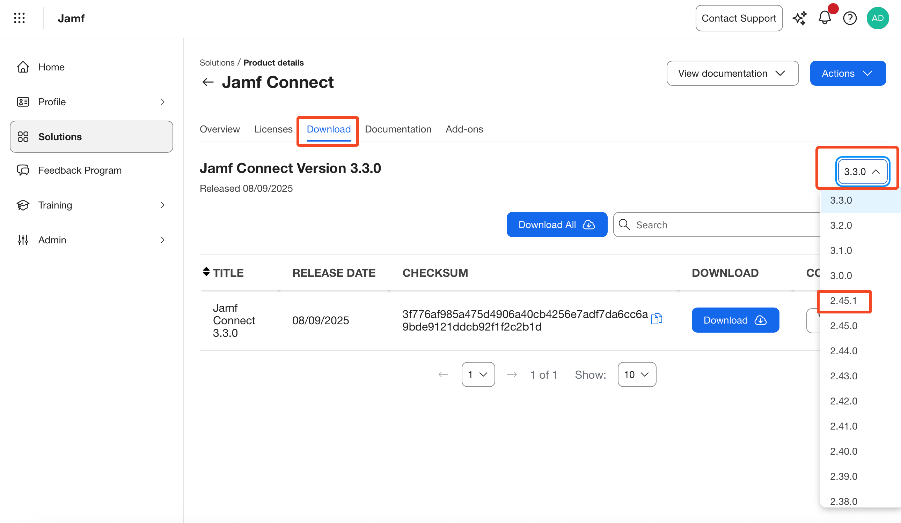
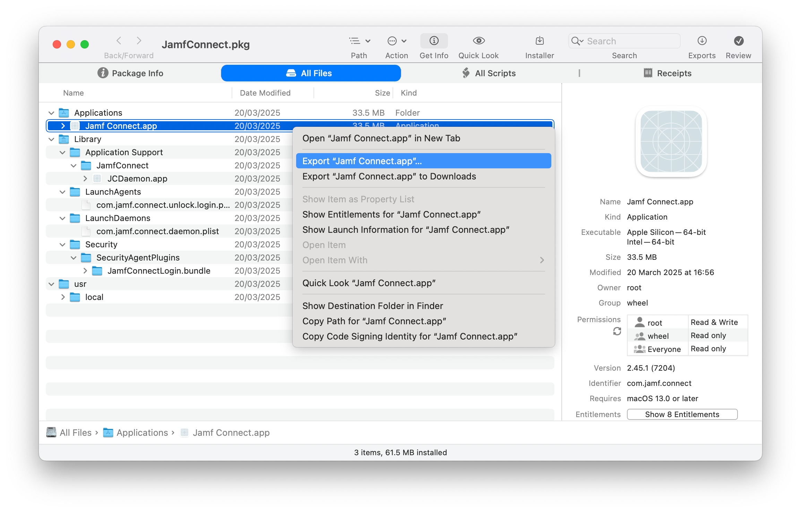

+++
title = 'Continue To Sync Passwords with Jamf Connect and Jamf School'
date = 2025-09-08
coverImg = "JCMenuBanner.png"
summary = "In recent releases of Jamf Connect the menu bar app is not included in favour of using Self Service + for Jamf Pro Admins...but what if you're a Jamf School Admin wanting to keep local and cloud passwords in sync with Connect? In this blog we explore the options and workflows."
tags = [ 'identity', 'macOS', 'workflows', 'scripting' ]
type = "blog"
+++

For as long as I can remember the Jamf Connect dmg that is provided by Jamf included two elements _(actually thats not entirely true, I do remember multiple dmg or pkg at the very very start...turns out Im going to nerd snipe myself within the first sentence this blog)_. The first element is the **login window "app"**, this is the part that provides the custom experience provided by the IdP, which can be branded and configured in a number of different ways. The point of this element is to ensure a successful authentication with the IdP and then [create a local user account](https://learn.jamf.com/en-US/bundle/jamf-connect-documentation-2.45.0/page/Initial_Local_Password_Creation.html) which the matching username and password of that in the cloud. 

The second element is what became the known as the **"menu bar app"**. The purpose of this element was to ensure that the local user account password [continued to match](https://learn.jamf.com/en-US/bundle/jamf-connect-documentation-2.45.0/page/Password_Syncing_with_Jamf_Connect.html#ID-000047b8) that users cloud password that is with the IdP. If it were ever out of sync it would kick off a workflow for the user to sync everything back up again. 

The menu bar app also enabled IT admins to add some quick links to open apps or websites and more recently was the method for users to invoke a [priviledge elevation workflow](https://learn.jamf.com/en-US/bundle/jamf-connect-documentation-2.45.0/page/Configuring_Privilege_Elevation.html), making them an Admin for a short, predefined amount of time _(should you as an admin want to switch this feature on of course)_. 

...and this, in a nutshell was Jamf Connect for a Jamf School Admin. However, if you've recently deployed Jamf Connect's latest version while building a new Mac, you might have been confused to find that although the Login Window experience is what you expected, you know longer have the menu bar app and can't find the app in your `Applications` folder either 

### So What Changed?
At JNUC 2024, in the [main keynote](https://youtu.be/zB3xuWjlxgY?si=XZFtLu5AeVb_EowE&t=2342), Jamf introduced [Self Service +](https://learn.jamf.com/en-US/bundle/self-service-plus-documentation/page/About_Self_Service_Plus.html). A evolution on Self Service that many Jamf and none Jamf customers alike know as the staple "Jamf App". As time has gone on though its not the _**ONLY**_ Jamf app and Self Service + looks to merge the Jamf end user apps into one. The Self Service + documents states

> Self Service+ is an end user application for macOS that allows users to access content and updates that have been preconfigured in Jamf Pro. In addition to acting as an enhancement and eventual replacement for Self Service classic, Self Service+ provides a streamlined end user experience by consolidating Jamf end user applications into a single app.

A few months ago we saw this concept start to take shape when Self Service + was able to tackle the tasks that the Jamf Connect menu bar app was used for. This meant for Jamf Pro Admins they could offer password sync and privilege elevations through the same app many of their user were already familiar with and not need to deploy the additional menu bar app. 

Expect, its part of the Jamf Connect dmg. 

So, essentially admins were deploying the menu bar app for Self Service + to remove it and take over that functionality. Over the same few months, with Jamf Pro releases it's become easier and more "default" to deploy Self Service + over Self Service Classic. As more people use Self Service +, less people need the menu bar app. 

Therefore, as of Jamf Connect version `3.0+`, the dmg now _**ONLY**_ contains the login window "app"

### Wait A Second, I Thought This Was About Jamf School...
If you are reading this thinking

- "I don't know what Self Service is"
- "Isn't Self Service for Jamf Pro only?"
- "I Didn't know you can use Self Service with Jamf School"

Then thats sort of the point of this blog post! If you are thinking one or a combination of the above, that likely places you squarely in the Jamf School only Admin camp. Not knowing about Self Service or Self Service + as a Jamf School Admin is completely fine since it's not used in Jamf School. If you, for whatever reason, have a foot in both Jamf Pro and School camps you likely also have questions about the use of Self Service in Jamf School. 

Simply, the answer is, Self Service + is only for Jamf Pro!

That does leave Jamf School admins with a bit of a gap, though. Jamf Connect no longer has the menu bar included and Self Service + isn't for Jamf School. On the face of it, it looks like Jamf Connect can only provide the account creation element via the login window app. Bad luck if you want to keep your password in sync or offer a privilege elevation solution, right?

Wrong! 😜

lets look at the options available to Jamf School Admins

### How Do I Continue To Use The Menu Bar Features?

Just to be clear, if you have currently deployed macOS devices with Jamf Connect menu bar app installed, you have nothing to worry about or act on. Upgrading to the latest version of Jamf Connect will not remove the menu bar app. 

The following discussed options and flows are for consideration when you re-deploy devices or deploy new devices in your environment. 


There are a few ways we can deal with things. The first 3 are more "out of the box" solutions but like with many things in life, if you are willing to put a little bit of work in, theres a forth solution. In my opinion, this gives the best result and would be the way I would tackle this challenge in the real world. 

1. Use Jamf School's App Installers
2. Continue to deploy Jamf Connect 2.45.x
3. Deloy Jamf Connect 2.45.x, followed by 3.x
4. Maintain a menu bar app only package and deploy the latest Jamf Connect pkg

**1. Use Jamf School's App Installers**  
At the time of writing at least, if you deploy Jamf Connect through [App Installers with Jamf School](https://learn.jamf.com/en-US/bundle/jamf-school-documentation/page/Jamf_School_App_Installers.html) it appears that the version has been pinned at `v2.45.1` which is the last version where the dmg contained both the login window and menu bar app elements. 

If you choose this method it means that your devices will get the menu bar app but also will not get the latest version of the login window. This might not be an issue as a whole but if the login window gets an update in the future that requires a later version and that you want to make use of, you wont be able to. 

The other consideration when using this option is how / when you deploy Jamf Connect. If you wish to have Jamf Connect as part of your onboarding flow and require the Jamf Connect login window to be the first place a user can sign in, App Installers is not the most reliable option. In this flow you'd want to deploy via an [ADE Package](https://learn.jamf.com/en-US/bundle/jamf-school-documentation/page/Jamf_Connect_Deployment_with_Jamf_School.html).

**2. Continue to deploy Jamf Connect 2.45.x**  
If you are using an ADE style workflow you will need to upload the package you wish to deploy, which means you can control the version of Jamf Connect gets deployed. This then becomes more of a question of where to get an older version of Jamf Connect from. Many users know that navigating to `https://files.jamfconnect.com/JamfConnect.dmg` will download the most recent version of Jamf Connect (this is the URL used in the [Installomator label](https://github.com/Installomator/Installomator/blob/main/fragments/labels/jamfconnect.sh) as well)

However if you are a Jamf Connect or Jamf for K12 customer you are also able download Jamf Connect's latest version _or_ a previous version from [Jamf Account](https://learn.jamf.com/en-US/bundle/jamf-account-documentation/page/Jamf_Account_Documentation.html).

    

Once logged into Jamf Account, and providing you have a licence and correct Jamf Account priviledges you can navigate to 

- `Solutions` -> `View Details` in the Jamf Connect box
- Click `downloads` in the menu across the top
- Then in the drop down menu at the right of the window select the needed version, in our case `2.45.1` 
- Once you have this dmg you extract the `JamfConnect.dmg` and upload it to Jamf School as an [In-house macOS package](https://learn.jamf.com/en-US/bundle/jamf-school-documentation/page/In-House_Content_Distribution.html)

This package is then ready to use in an ADE workflow and once deployed will install both the login window and menu bar app elements. 

Like with the above option the version of the login window is the older `2.45.1` version. If and when an update to the login window is released that has a feature you want to use in that ADE workflow, you're kind of out of luck. 

**3. Deloy Jamf Connect 2.45.x, followed by 3.x**  
The obvious answer here is to deploy version `2.45.1` using one of the methods discussed above and depending on your needs and then install the most up to date version directly afterwards.

Like I said before, if you have 2.45.1 already installed and then deploy `version 3.x` or above you the menu bar app isn't removed _(or a least at the time of writing)_. Doing this will ensure you get the menu bar app for your password syncing and privilege elevations as well as the latest and greatest in regards to the login window "app".

How you install the latest version, weather thats app installers after the fact, another pkg maintained as an in-house macOS pkg or maybe even using a tool like [Installomator](https://github.com/Installomator/Installomator), is up to you. 

However, for me this just feels like a false economy. Install one thing to immediately replace it with something else and even though Jamf Connect is a small pkg when you scale this for the numbers of your deployment, the idea of downloading "the same thing" twice just doesn't feel right from a bandwidth point of view either. 

I'm not at all saying that this is wrong, I just think we can work a little smarter...which brings me to

**4. Maintain a menu bar app only package and deploy the latest Jamf Connect pkg**  
We've already covered the fact that the Jamf Connect dmg pre `version 3.x` contained both the login window and menu bar elements and anything `version 3.x` onwards, only the login window element. 

If you take the pkg from both the latest and the `2.45.1` versions and inspected them with a tool like [Suspicious Package](https://mothersruin.com/software/SuspiciousPackage/), you'll see that the only thing that looks different is the addition of `/Applications/Jamf Connect.app` in the `2.45.1` pkg. This suggests that the `Jamf Connect.app` is a self contained app and the other elements in the pkg are related to the login window. 

If we were to extract the `Jamf Connect.app` and re-package, we could deploy this independantly of the latest version of the login window app, at any point we like. You might be reading this wondering how this is any better then installing one version and then another right over the top of it. If this is you, here are a few reasons I think this is the better way

Firstly, now that the menu bar app is not contained in the newer versions we can, with some confidence, assume that Jamf will not be releasing regular, if any, updates to this app. This means, that although this is an extra pkg to add to my deployment I wont regularly _(if ever)_ need to maintain versions of this. Build the pkg once and pretty much forget about it. 


I should point out this doesn't mean we'll _never_ see an update to the menu bar app. Who knows if we'll see any security patches or even a notice that is not supported on macOS of the future. So, depending on how far in the future you are reading this, maybe best to double check my thought process here!


Secondly, the menu bar app is used in the user space, once the user logs in. Its not needed for ADE workflows, we only need the login window element for these workflows. That means I can deploy this pkg later in my deployment workflow, it hasn't and shouldn't be added as a ADE package. This is also less "wasteful" than deploying a "complete" Jamf Connect twice, one to get the menu bar app and another to update the login window. 

Finally, doing this means you can focus on ensuring the login window element is always the latest version in your ADE flow which means you can make use of the latest and greatest features that come along with the login window as time goes on. Again, how you get the latest version in your ADE workflow is going to be down to your onboarding flow but this way also lends itself very nicely to a [Jamf Setup Manager workflow](https://github.com/jamf/Setup-Manager), where Setup Manager will always deploy the latest version of Jamf Connect _(and means you're not actually maintaining a "latest" Jamf Connect package in Jamf School at all)_.

### Extracting the Jamf Connect Menu Bar App
If like me, you also think that this option is the best of all worlds, _(the latest login window "app" and the installation of the menu bar app in a way that has the least maintenance involved)_ then you might be wondering how to extract and re-package the menu bar app. Well, if thats you, you are in luck....lets dig in. 

The first thing that you will need is the `2.45.1` version of the Jamf Connect dmg which, as described above can be found from your Jamf Account. With this in hand mount the dmg and copy the JamfConnect.pkg to desktop _(or other suitable location that works for you)_

Theres a few ways to extract the app from the package, with the simplest being install the pkg. Only this package has a `postinstall` script which changes your default login experience for that of Jamf Connect and if you do this on a production machine and / or don't have a Jamf Connect configuration profile installed....you're in for a bad time. 

As such, **Don't install the package**. 

Instead, if you haven't already got [Suspicious Package](https://mothersruin.com/software/SuspiciousPackage/), go and download it. In my opinion it should be in every macadmins toolkit anyway. Once installed open the app and drag the `JamfConnect.pkg` into the app window, this will allow us in inspect whats in the package. 

Click on on the `All Files` tab and then the disclosure triangle next to `Applications` to expand, from here you will see the `Jamf Connect.app`. Right click the `Jamf Connect.app` and choose one of the export options _(you can choose a location on the disk or quickly export to downloads)_.

    

The app is now extracted from the original package and ready for us to re-package. 

### Creating a Jamf Connect Menu Bar App Only Pkg
I've covered creating packages in a few blogs now and often point to [Armins](https://scriptingosx.com) packaging book if packaging is new to you but in a recent [scriptingosx blog](https://scriptingosx.com/2025/08/books-update-2025/) Armin mentioned he will be soon pulling the book from the book store as there are elements that are out of date. However, if you follow the link to the blog he is rewriting the core elements and releasing them as a series (rather than a book) over at [scriptingosx](https://scriptingosx.com).

Usually, I'd also mention [Jamf Composer](https://www.jamf.com/products/jamf-composer/) as an option for creating packages. Only this time we have to do a little bit extra which we can only do be scripting our package creation rather than relying on Composer. 

Thanks to the recently re-written articles that Armin is releasing, when I came across a specifc problem while testing, my brain kicked me to remember this 

> In recent versions of macOS, pkgbuild will preserve extended file attributes in the payload.  
> [...]  
> You generally do not want to have extended attributes be part of your package payload. This is especially true of quarantine flags!

Out of context you might be a bit 🤷🏼‍♂️

Essentially, since we downloaded Jamf Connect from the internet, macOS flags the app as risky and when you deploy the package it fails. Or more so, when you try to run the app after installing the package it will not run, instead displaying a message that it might be malware. Clearly, this is not a good experience for our end users or the behaviour we want. 

In older versions of macOS the file attributes were not carried over with the file when being packaged so wasn't something that we needed to worry about. As Armin points out however, in recent macOS they do carry over. So we need to be sure we remove any file attributes. This can be done with the following command




As noted above Jamf Composer does currently not have the the ability to remove the file attributes required for this workflow 


As usual I have added an example [packager script](https://github.com/cantscript/JamfConnectMenuAppPkgr/tree/main) to my [GitHub](https://github.com/cantscript).

Once you've downloaded the Repo you will need to add the extracted `Jamf Connect.app` to the `payload/Applications` folder before running the pkgr script.

### Using the Jamf Connect Menu Bar App Pkg
After the pkgr script has ran the resulting pkg will be on the desktop of your current user. From here you can treat the pkg as any other in-house pkg in Jamf School. 

- Navigate to Apps -> Inventory and click + Add App
- Choose Add In-House macOS Package
- Navigate to the `JamfConnectMenuBar.pkg` on your machine and drag to the Jamf School window
- Once uploaded click save

From here scope to the target devices as required but remember this now does not need to be part of your ADE packages. Instead you can just scope it like all other apps after the fact. 

There is one additional thing and if you are already a Jamf Connect customer, you're likely already doing this...

The Jamf Connect menu bar does not automatically open when a user logs in but needs to be open / in the menu in order to do the continued password sync checks. To ensure that the app opens at login (and in actual fact re-opens any time its closed) there is a `JamfConnectLaunchAgent.pkg` found in the dmg under `resources`


At time of writing the `JamfConnectLaunchAgent.pkg` is available in both the `2.45.1` and `3.2.0` (latest current version) dmg's


This pkg should be deployed alongside the package you have created for the menu bar app (for extra credit, create a single package that includes both this LaunchAgent and the App). This way you can be sure the menu bar app is always open and able to operate. 


One thing that I have noticed during my testing is that if the menu bar app is open while a new version of Jamf Connect (through app installers, Installomator, or that you've updated the "in-house" pkg in Jamf School) is trying to install, a user will get a pop up with wording to the effect of "Jamf Connect needs to update please close Jamf Connect".

Of course, if you use the `LaunchAgent` as suggested above, if the user chooses `quit` the app just re-opens and theres a loop created where the notification appears, user quits, menu bar re-opens, notifications appears, user quits etc etc. 

Logging out will enable the menu bar app to close and the update to take place. 

Since I've been working with a fairly current version, Im not sure if this happens every time theres an update or just the first time after you've installed the menu bar app independently. 

Either way, worth considering updating Jamf Connect when theres going to be no user logged in (for lab devices this is a little easier). 


### To Wrap Up
To quickly wrap up. Things have changed with the Jamf Connect dmg due to the introduction of Self Service +, a tool that is available only for Jamf Pro. 

This doesn't mean a Jamf School admin can not make use of password syncing or privilege elevation, theres a few options available. 

In this post we've covered a number of ways but I firmly believe maintaining your own menu bar app, by re-packaging it, is the best and most flexible way forward. 

To make this even easier, the example pkgr script that I've shared on [GitHub](https://github.com/cantscript/JamfConnectMenuAppPkgr/tree/main) only requires you to add the menu bar app into a pre-defined folder and to run the script. There really is very little work if you do want to use this method. 


I started the post nerd snipping myself, so lets end with other nerd snipe. Depending on your licensing, in Jamf Account you might still be able to download Self Service + and deploy it in Jamf School. Self Service + will then show only the Jamf Connect Menu Bar features (other Self Service + features are for Jamf Pro only)....

However, just because you can doesn't mean you should! Its a confusing experience for your end users who will be used to using Jamf Teacher or Student for self service purposes but then need to use an app called Self Service + if they want to make themselves an admin for a period of time or want to handle a password change. 

So, just no....
