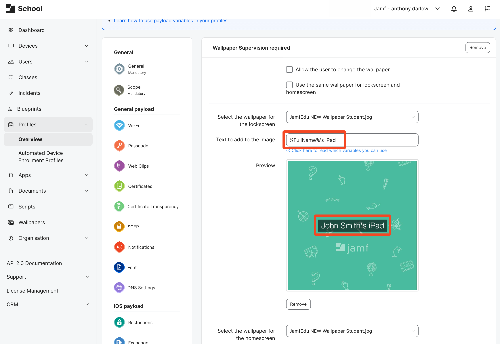
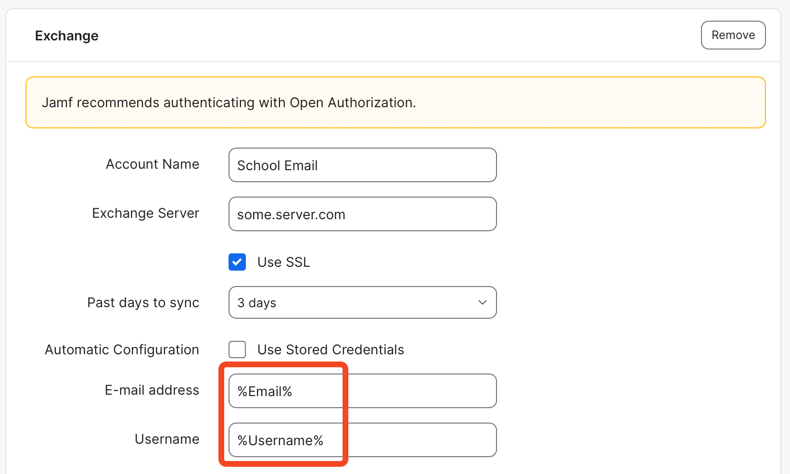
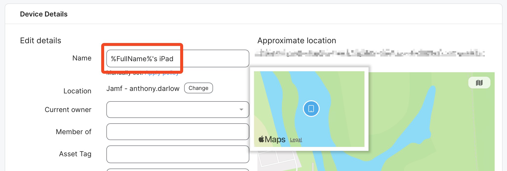
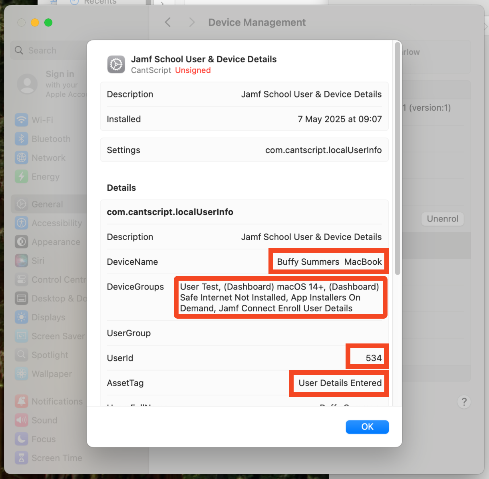
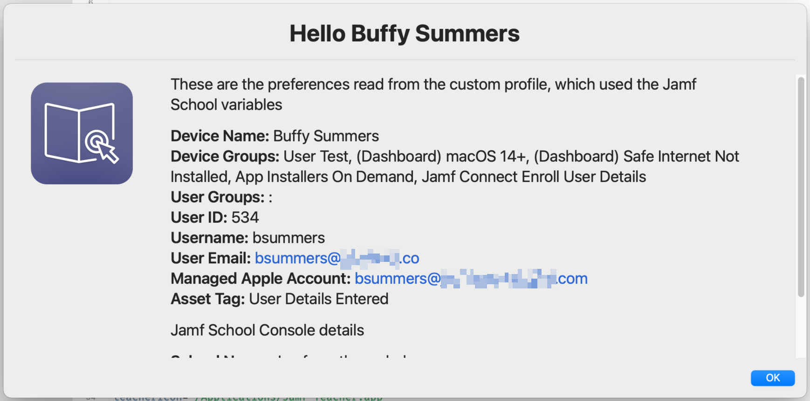
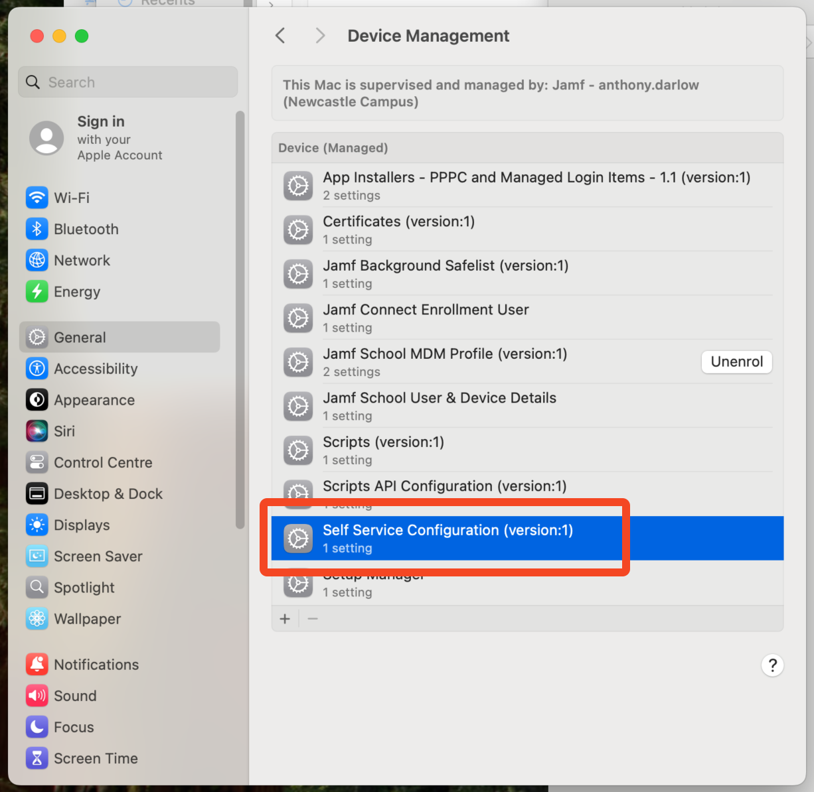
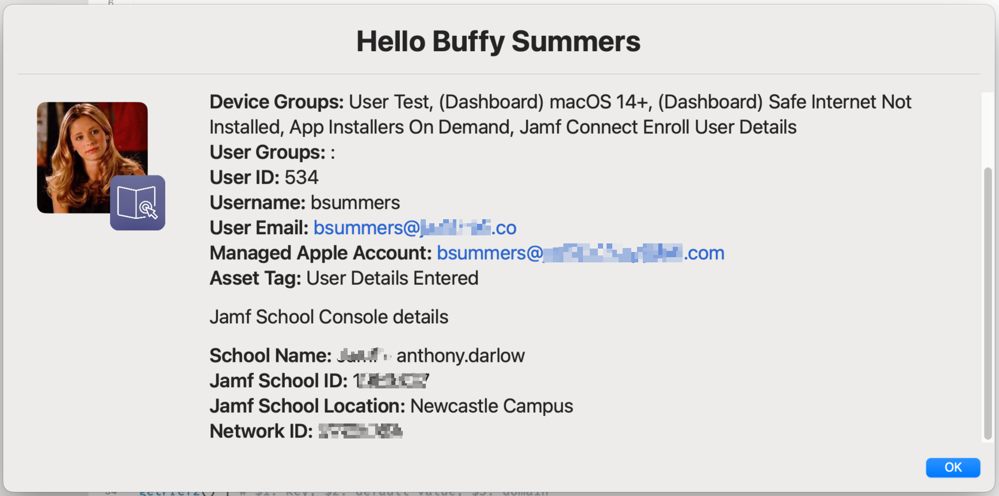

+++
title = 'Using Jamf School Variables in Scripts'
date = 2025-05-07
coverImg = "localvarcover.png"
summary = "Jamf School allows for variable substitution all over the place, just not in Scripts! Learn how to deliver Jamf School variables to devices for use in Scripts"
tags = [ 'Scripting', 'Profiles', 'Workflows' ]
type = "blog"
+++

If you are a Jamf School Admin theres a good chance that you've used variables in your deployment. 

Variables are super useful to an Admin as they provide a way to create configurations that requires unique values without having to create many (10's, 100's, 1000's depending on your deployment) individual items for each unique values. The format for variables in Jamf School is `%Variable%` and there are many different variables that can be substituted. You can find a full list in the [documentation](https://learn.jamf.com/en-US/bundle/jamf-school-documentation/page/Payload_Variables.html)

Variables can be used in a number of places within the Jamf School console, not just in Profile payloads.

### Jamf School Variables

Popular use cases for variables are for naming devices (using `%ProductName% - %SerialNumber%` will change the devices display name with a prefix of the device type with the individual devices serial number after) and creating custom iOS wallpapers which display the owners name. For example creating a wallpaper payload where the image is a schools colours and logo and then adding text on top of this. Using `%FullNames%'s iPad` would then display the full name of the user assigned to the device. You can actually use variable's to generate an QR code on the wallpaper which, once scanned, will take you directly to that device record in the console. 

    

Depending on the variable that you are using they are also dynamic. Lets take the name of the device again, only this time we use `%FullName%'s %ProductName%` and the device's owner is Alice. The devices name would be `Alice's MacBook Pro`. If we were then to give that device to Bob and assign him as the owner, upon next check in the devices name would change to `Bob's MacBook Pro`. All without the admin needing to rename the device manually. 

Variables are very powerful when used correctly and can be key when in workflows or automations. Its all about working smarter not harder. 

### macOS Scripting

As mentioned above variables can be used in various places in the console, not just in the Profile payloads section. They work across all supported platforms, iOS, iPadOS, macOS & tvOS, and if you are supporting macOS you might have tried to use these Jamf School variables in your scripts only to find this is about the one place they are not supported!

There are many reasons that one might what to use the Jamf School variables in a script, as I always say when it comes to scripting you are limited only by your imagination but Im sure you could think up some times where it would be useful to have information stored in Jamf School variables available in a script. Even if its simply who is the current owner, which of course doesn't always equal the name of the user account currently signed in or if you use Locations in Jamf School, which location is the device assigned to. 

However adding `%Username%` to a script wont result in Jamf School substituting that value with in your script. It'll stay is `%Username%` and give you a result that you didn't intend. 

So, if Jamf School variables can be so useful, how can we use them within our scripts? The answer is, make them available locally on the device.

### Using Jamf School Variable Substitution 
At the risk of teaching people to suck eggs, lets quickly look at what happens when we use variable substitution in the Jamf School Console. After all, for every admin out there that has been doing this for years, theres another who only just started managing devices. 

Essentially, when you use a `%variable%` you are saying I want to use a value that is yet to be determined, the `%variable%` is just a placeholder. Depending on which variable you use, Jamf School will then add the "real" value when creating the configuration. 

Lets take an example of a profile that asks an admin to provide the users email address as part of the configuration. At this point the Admin has no idea who the user will be, it could be 100's of possibilities. So instead they use the value of `%Email%`. 

    

Since Jamf School also knows about users in the system and their relationship with devices, when it delivers the profile to the device it says 

_"Okay I need to replace `%Email%` with the real value. I can see that this devices owner is Ant Darlow, I will look up that users record stored in my system and find his email value, which is ant@email.com. Now I will write this real value into the profile"_

The same is the case with any of the available variables in the console, think `%SerialNumber%` or `%uuid%`, these are values that Jamf School already store about the device and can be substituted in place of the `%variable%` placeholder. 

    

Without the variable an admin would need to create a unique profile for each and every user and hardcode the real value into each one. Variables allow for this "configure once, use for all" type of workflow.


Its worth noting that if a "real" value is not available Jamf School configurations will still show the `%variable%` placeholder. For example, if you name the device with `%FullName%` and the device does not have an owner, the device will be called _FullName_, until the point is does have an owner assigned


### How to use Jamf School Variables in Scripts
Thats all very well and good but you might be thinking, _"how does that help me use these Jamf School variables in scripts"_. The answer it two fold and using the fact that Jamf School will substitute these variables for real values when creating configurations....configurations such as Profiles.

Once we have a profile, that contains these "real" values, on the device, its basically a preference file. With a script we can read information from preference files or in our case our custom profile!. 

I'll walk you through the steps as we go along but as an overview

1. Create a custom profile containing variables you might need or want to us in a script  
2.  Deploy custom profile with Jamf School  
3. Create a script (or edit one you have) that reads the values in the custom profile  
4. Win at admin-ing and drink coffee

To follow along you'll need a way of creating a Profile. This could be something generic like [BBEdit](https://www.barebones.com/products/bbedit/) or [Coderunner](https://coderunnerapp.com) or something most specific to creating preferences such as [PlistEdit Pro](https://www.fatcatsoftware.com/plisteditpro/). 

There are also an [example profile](https://github.com/cantscript/LocalJamfSchoolVariables/blob/main/LocalJamfSchoolDetails.mobileconfig) over on my [GitHub](https://github.com/cantscript/LocalJamfSchoolVariables/tree/main). 

### Step 1: Creating a Custom Profile
The First step is finding out the Jamf School variables available to you and choosing which ones you are going to need or want within your scripts, a full list can be found in the [documentation](https://learn.jamf.com/en-US/bundle/jamf-school-documentation/page/Payload_Variables.html)

Once you have choosen the values you will need to add them to the profile as a key / value pair.



The `key` tag is the name for the value and its important that we keep these names sensible and to the point as its these keys we will be reading in our script but they can by anything. You will thank yourself in the future if you keep them simple and concise , I promise. 

As for the `value` you will see that I have added the Jamf School variable (in the above example `%AssetTag%`. Remember the placeholder will be substituted for the "real" value once deployed by Jamf School, it doesn't matter that you aren't creating the profile in Jamf School. However, if you were to upload this to another MDM the chances are almost certainly zero that any substitution will happen. Maybe that MDM doesn't use variables at all or uses a different syntax (for example Jamf Pro uses `$variable$`, opting for `$` instead of `%`)

If this is the first time you've ever created a profile manually to upload to Jamf School (or any other MDM for that matter) I highly suggest you take my [example profile](https://github.com/cantscript/LocalJamfSchoolVariables/blob/main/LocalJamfSchoolDetails.mobileconfig) and edit that as required, rather from starting from scratch. 

There are a few values that you might want to change from the example

`PayloadType`  
This is the preference domain that the profile will create and you will read the data from in your scripts. Again this can be anything you like but is usually a reverse domain. If you require to use you own preference domain be sure to change this but for the following examples I will assume the example default is bring used. 

`PayloadOrganization`  
At both the top level and within the `PayloadContent`. You may want to change this you match your organisational name

`PayloadDisplayName`  
At both the top level and within the `PayloadContent`. The name displayed for the profile / payload in the system settings of macOS

`PayloadDescription`  
The description displayed for the profile in the system settings of macOS

Finally, if you have are comfortable with creating and editing a `plist`, you could instead create a plist and save it with the preferred preference domain (following the example it would be `com.cantscript.localUserInfo`) and upload it to Jamf School as shown in the next step. Jamf School will wrap the plist into a profile once uploaded / deployed. 

### Step 2: Deploy Custom Profile with Jamf School

With you custom profile prepared and saved, the next step is to upload it and deploy it with Jamf School. This is a fairly easy process but if you've never need to do this before, navigate to 

1. `Profiles` -> `Configuration Profiles` and click `+ Create Profile`
2. Choose `Upload custom profile`
3. Navigate to the Custom Profile on your machine and drag to the Jamf School window
4. Once uploaded click `next`
5. Add a `Profile Name` (and a `Description`, as required) and click `Next`
6. Click `Finish` on the next page
7. Click `Save`

You custom profile is now ready to be deployed. This can be done in a few ways with Jamf School, use your regular scoping methods to deploy to your target device(s) when ready (_you should only deploy to your test device for now_).


If you have used any of the user variables in your profile, you should consider scoping the profile only once the device has an owner assigned using smart groups. Otherwise the values will not be substituted and even if a owner is assigned after the fact the profile will need `reinstalled`


On a test device you can verify that the profile has installed and that the `%variables%` have been replaced with the "real" values that are stored in Jamf School

    

### Step 3: Read Profile Values in a Script
There are 2 ways that I know to read profile values within a bash script and I suspect there are more. The first is to use `plistbuddy`. A function can be written which enables you to read a specific key from the plist, offer a default value (if the key isn't there) and store it an a variable. [Thijs Xhaflaire](https://github.com/txhaflaire) uses this method in his [DiskEncrypter](https://github.com/txhaflaire/DiskEncrypter) project.  
An example of this function is



And the usage to store the result to a variable within the script would be as below; where `AssetTag` would be the key we are looking for and `"no data"` would be the default value if there was no `AssetTag` key



The second way I was shown by [Armin Briegel](https://github.com/scriptingosx) aka [scriptingosx](https://scriptingosx.com/about/). This method is more robust as it reads key values for the preference domain, no matter where the plist(s) are located and these locations are numerous. Its a little outside of the scope of this blog but there could be a plist `com.example.plist` in `/Library/Preferences`, `~/Library/Preferences` and `/Library/Managed Preferences`. There is then a hierarchy in which preference level takes precedence, however Configuration Profiles (`/Library/Managed Preferences`) overrule everything else. 

This method will read key values across the all possible preference locations and take the hierarchy into account when providing the result (this is different to method 1 which is read a specific plist in a specific location)

Although this method is slightly different, for our use case here the results are  largely the same with both. The method of reading the preference and key is once again wrapped into a function



Given the above, there is also a function that can check if the key is set and locked with a profile. Again, outside of our use case here but this can be used to ensure that the key value you are reading is from a profile and not elsewhere. I've used this in other projects to there is no profile installed and exit the workflow



The usage to store the result to a variable within the script would be as below; where `AssetTag` would be the key we are looking for and `"no data"` would be the default value if there was no `AssetTag` key



Now this is where I leave the hard work to you. How, what or why you need or want to use these variables is completely dependant on you and your environment (and even imagination). I've given an [example script](https://github.com/cantscript/LocalJamfSchoolVariables/blob/main/ExampleScriptReadingPrefs.sh) which simply uses [SwiftDialog](https://github.com/swiftDialog/swiftDialog) to display the information, thus showing I am "accessing" those Jamf School variables in a script (the script can be ran from Jamf School using the scripting module) even if in reality this example is nothing more than "show and tell".

    

### One Last Thing
Since we now know how to read key / values from a profile. If you are also using Jamf Student or Teacher Jamf School sends an additional profile to macOS device automatically. This profile contains some information to configure the app so that you don't have to manually log in, for example. 

    

If you take a look in the system settings you can see the key / values it provides. Some of these are the same as you may have in your custom profile (which means you might not even need to create a custom profile, depending on your needs!) but has the additional keys of `isTeacher` (which can be `true` or `false`) and `photo` (with a value that is a URL to the stored picture in your Jamf School instance). 

So if you use photos to attached you users in your deployment you now has access to personalise notifications (like my swiftDialog example) with the owners photo too.

    

The managed preference domain for this is `com.zuludesk.macos.selfservice.plist` and managed preference in general (incase you what to read some other profile some time) are located in `/Library/Managed Preferences`

I have also included an [altered script](https://github.com/cantscript/LocalJamfSchoolVariables/blob/main/ExampleScriptReadingPrefs_Advanced.sh) over at [GitHub](https://github.com/cantscript/LocalJamfSchoolVariables/tree/main) that contains this additional logic to use the photo and add a teacher or student app icon depending on if result of the `isTeacher` key. 

### Further Reading

If this is your first time diving into profile and plist creation but its sparked an interest, here are a few things you might want to check out

 [Config Profile and manage ALL the things…just about](https://boberito.medium.com/config-profile-and-manage-all-the-things-just-about-cafea8627d4b) by Bob Gendler  
 [swift-prefs](https://github.com/scriptingosx/swift-prefs) by scriptingosx