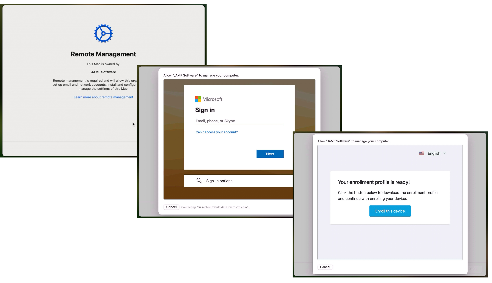
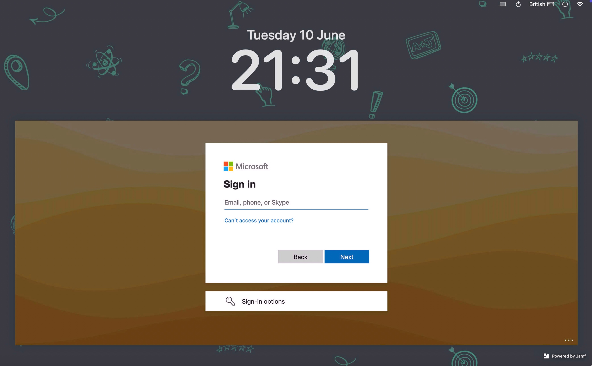
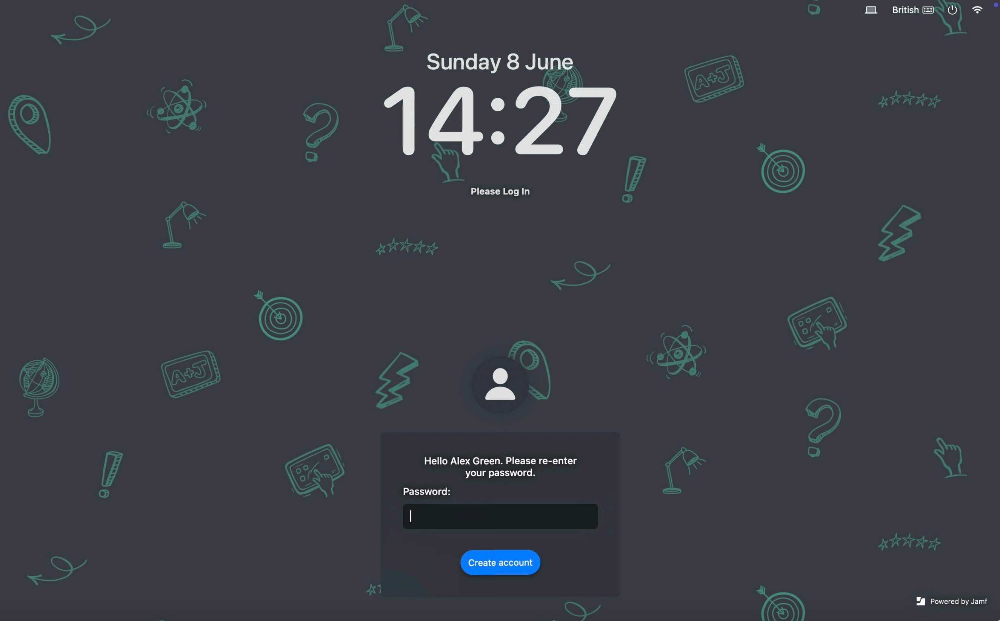
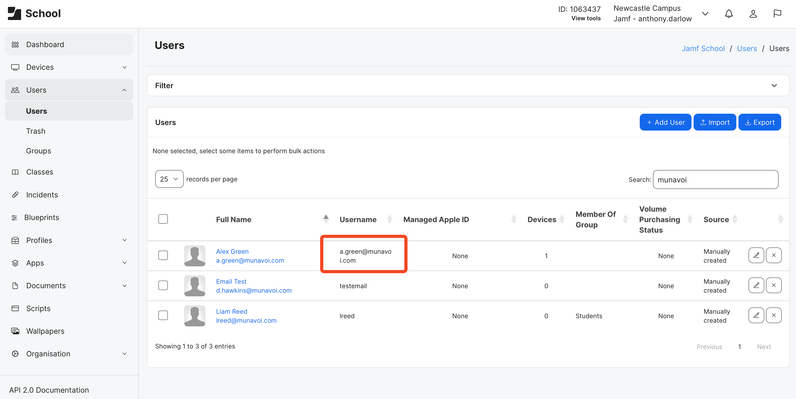

+++
title = 'macOS Authenticated Enrolment Passthrough in Jamf School'
date = 2025-06-10
coverImg = "jcbanner.png"
summary = "Creating a user experience with the least amount of friction is key to a great onboarding and theres nothing more grinding than entering credentials over and over. Find out how to passthrough user details from an Authenticated Enrolment to Jamf Connect."
tags = [ 'Profiles', 'Workflows', 'Identity' ]
type = "blog"
+++

Creating a frictionless onboarding experience can be the key to a successful deployment, especially if your end users are driving the onboarding. As an Admin we are well aware of the amount of times a user might be asked to _"log in"_ or enter their credentials. That might be before the user even actually logs in to the user space, where they'll likely get asked to login to various apps as well. Now, I know that `SSOe` can help with some of this once in the user space but for this blog, `SSOe` is out of scope. 

What I want to focus on in this blog is situations where an admin is using [Authenitcated Enrollment](https://learn.jamf.com/en-US/bundle/jamf-school-documentation/page/Automated_Device_Enrollment_Experience_Customization.html), [Jamf Connect](https://learn.jamf.com/en-US/bundle/jamf-connect-documentation-current/page/Identity_Provider_Integrations.html) and a supported idP, which for this particular workflow must be Entra. 

### Setting The Scene
Incase Authenticated Enrolments or Jamf Connect are new to you, lets quickly cover them off

**Authenicated Enrollment**  
When enrolling a device using _Automated Device Enrollment_ an Admin can choose for the user to authenticate. If the user enrolling the device doesn't have a user account with the chosen provider or isn't able to provide the correct credentials then the enrolment cannot be completed. This stops unauthorised users being able to enrol school owned devices or said another way, if the devices goes "missing", gets wiped and ends up on the second hand market, unless you have a valid user account in the schools directory the device is a brick. 

Theres a second advantage to using an authenticated enrolment, which if i'm honest is likely the main reason for using this feature, is that upon successful authentication, the device is then assigned to the authenticated user in Jamf School. Depending on the setup in Jamf School, this can then trigger the rest of the onboarding experience that is unique to that user. For example getting a different configuration if they are a teacher than a student or if the student is in Year 7 or Year 10. 

To try and keep on topic, I'm not going to cover the steps to configure the `Authenication` module in Jamf School or how to build an `ADE Profile` with Authenticated Enrolment configured as it is well documented. Jamf School can point to Entra, Google, LDAP or its internal directory for this feature.  
* [Customising Enrollments](https://learn.jamf.com/en-US/bundle/jamf-school-documentation/page/Automated_Device_Enrollment_Experience_Customization.html#ariaid-title5)  
* [Microsoft Entra ID Integration](https://learn.jamf.com/en-US/bundle/jamf-school-documentation/page/Microsoft_Azure_Integration.html#ID-0000cc19)  
* [Google Sign-In Setup](https://learn.jamf.com/en-US/bundle/jamf-school-documentation/page/Google_Sign-In_Setup.html)  

**Jamf Connect**  
In the context of an onboarding, Jamf Connect creates a local macOS account based on idP details and continues to keep the password in sync. Essentially meaning that the local user account name and password match that of the one at the provider _(there are many [idP's Connect works](https://learn.jamf.com/en-US/bundle/jamf-connect-documentation-current/page/Identity_Provider_Integrations.html) with)_ and if the password is changed at the provider the change is synced to the local account too. 

Again, to keep on topic, I wont be covering how to configure Jamf Connect with a given idP _(although I'll be using Entra in my example and will link to that below)_ or how to configure a basic deployment with Jamf School. However, if you need this guidance I've listed some useful documentation below.  
* [Integrating Jamf Connect with Microsoft Entra ID](https://learn.jamf.com/en-US/bundle/jamf-connect-documentation-current/page/Integrating_Jamf_Connect_with_Microsoft_Azure_AD.html)  
* [Jamf Connect Deployment with Jamf School](https://learn.jamf.com/en-US/bundle/jamf-school-documentation/page/Jamf_Connect_Deployment_with_Jamf_School.html)  

### So What Is The Actual Issue Here?
Now the we know what the two components we'll be working with do, lets talk about the user experience while onboarding their device. 

Assuming for a second that I am the user, a teacher, first day on the job. I get given a new MacBook, along with a new username and password. Im told I'll be able to set it up myself either on site or at home. I turn it on, choose my language, location and connect to wifi. The next screen I see it the `enrolment screen` and I select `enrol`. 

Since the admin has decided on an authenticated enrolment, the next screen I get presented with is a Microsoft looking login screen where I'm asked for my credentials.

    

I was given them at the same time as my MacBook so I log in. All is good and the enrolment continues, I may or may not set up things like location services, Apple ID, touchID etc etc. 

Once thats all over I land at the login window, which is Jamf Connect and presented with another Microsoft looking login screen....the exact same one as I've already logged into. Or at least to me, as a user it looks like the same one

    

 

This is the 2nd time I've had to log in within a few minutes and as a user Im confused why I've had to log in to what looks like the same thing again. Im also annoyed that I've had to enter my whole username and password, again. 

For some, this might not sound like too much but remember there are lots of users in Education that are either not super confident with IT or, in the case of students, not yet IT proficient enough to enter a username and password correct multiple times.  

As an Admin, we know that although the user thinks they've logged into the same thing, since they've seen the same Microsoft login window, what they've actually done is prove they are a valid user to further the enrolment and then created a local user account on the device. The reason they got 2 log in windows that looked the same (in that they were that Microsoft looking window) was because both the `Authentication` module in Jamf School and the Jamf Connect `configuration` are pointing to the same idP, in our case Entra. 

### Creating A Better Experience
Since both components are pointing to the same idP wouldn't it be better if after the user has authenticated at enrolment that these details are are passed onto Jamf Connect so that they didn't need to go through the whole experience again? 

I think yes!

    

If you've ever used Jamf Pro, you'll know that this very thing is achievable in product via a tick box at a pre-stage enrolment. Just because that same option isn't available in an ADE profile in Jamf School, it doesn't mean we cannot achieve this same result. 

    

The key to this workflow is actually `variables` in a configuration profile. If Jamf School variables are not something you are familiar with, then take a look at this [previous blog](https://cantscript.com/posts/using-jamf-school-variables-in-scripts/) that explains how these work.

In a nutshell we are going to create a workflow that does the following
* Authenticates the user at enrolment  
* Assigns the user to that device  
* Delivers all required profiles and packages for Jamf Connect  
* Delivers an additional profile to the `com.jamf.connect.login` domain, where certain user variables have been substituted for the assigned users real details  
* Jamf Connect appears and already has the account name and username filled (based on the Authenticated Enrolment)  
* User only needs to enter the password at the Jamf Connect window, which sets the local account password  

### Bill Of Materials 
Before looking at the additional configuration profile for the rest of the blog we'll assume that you have the following configuration items in place

**Azure / Entra ID**  
* Enterprise App configured correctly for Jamf Connect

**Jamf School Configuration**  
* Authentication Module configured to work with Entra ID Enterprise App

**Jamf School Items**  
* Jamf Connect pkg uploaded  
* Jamf Connect login and menu bar configuration profiles uploaded, configured as required  
* _(Optional)_ Jamf Connect branding pkg  
* ADE profile  
* ADE profile assigned to target devices

**ADE Profile Options**  
* with Authenication selected  
* with assign authenticated user selected  
* Connect login and menu bar configuration profiles assigned  
* Connect pkg assigned  
* _(Optional)_ Jamf Connect branding pkg assigned  

If you haven't got any of this in place, use the documentation listed above to configure these items before moving on to the next section. 

### Additional Jamf Connect Profile
As mentioned above the key here is an additional piece of Jamf Connect login configuration. If this is in place at the Jamf Connect login window, rather than presenting the user with idP login experience the account name and username is pre-filled with the assigned users details. Asking the user to only enter their password, which must be the same as their idP before they can proceed (this means the local account username and password is in sync with the idP from the very off set) 

In order to pre-fill the correct details Jamf Connect Login expects the keys `EnrollmentRealName` and `EnrollmentUserName` in its preference domain `com.jamf.connect.login`. 

`EnrollmentRealName` is the `Full Name` of the local account. Usually this is the name that is more friendly, for example _Ant Darlow_

`EnrollmentUserName` is the `Account Name` of the local account, the one that is used for the user home folder. Usually this would be something more like _ant.darlow_ since everything must be lower case and with no spaces. In the case of Jamf Connect, this must be the full email address (UPN) as you would type if you were entering it in the Microsoft login window, e.g. _ant.darlow@example.com_. The local Account name / home folder then becomes the part before the `@`. So although you must provide the full UPN of _ant.darlow@example.com_ the home folder and account name becomes the more manageable _ant.darlow_ 

In a nutshell, what we are saying here is we need to offer up the `Full Name` and the `Email` of the user to Jamf Connect through this configuration. Of course we're not going to create a profile for each and every user with their data hardcoded, we'll use [Jamf School variables](https://cantscript.com/posts/using-jamf-school-variables-in-scripts/). We can simply use `%FullName%` and `%Email%` variables in the profile which will be sustituded for the assigned users real values, which would look something like this



I've wrapped these up into the required [profile](https://github.com/cantscript/macOSAuthenticatedEnrolmentPassthroughinJamfSchool/blob/main/Jamf%20Connect%20Enrollment%20User%20for%20School.mobileconfig) that you can find over on my [GitHub](https://github.com/cantscript). Since it relies completely on variables you can use this in your environment as is. The only thing that you might want to change is the following with your company details. 



To edit the details you could use something generic like [BBEdit](https://www.barebones.com/products/bbedit/) or [Coderunner](https://coderunnerapp.com) or something more specific to creating preferences such as [PlistEdit Pro](https://www.fatcatsoftware.com/plisteditpro/). 


If you're not sure how to upload a custom payload I cover it in [this blog](https://cantscript.com/posts/using-jamf-school-variables-in-scripts/) under the heading "Deploy Custom Profile with Jamf School"


### Assigning The Additional Jamf Connect Profile
The last part of the puzzle is to assign this profile to your target devices (assuming you have everything in the BOM in place). This could be done in 2 ways depending on your deployment

**Option 1: Scope to Device Group Along with Other Configuration**  
If you are anything like me you'll have a main _macOS Configuration and Apps_ group where you assign your core configurations and apps for macOS regardless of who owns the device. If not I'm sure you'll have something similar. 

You can add the additional Jamf Connect Profile to this group or any group that targets the macOS devices that you want to run this flow on....which will be the same ones as your **_Authenicated Enrolment ADE Profile_** is scoped to. 

This feels like the safe option since we know the profile will 100% land on the device after the user assignment from the authenticated enrolment has been reported back to Jamf School and therefore the variables substituted correctly.

Now the _"problem"_ with this method is that depending on what setup assistance steps you skip you might end up on the Jamf Connect screen before the additional profile has landed on the device. This will result in the normal "please enter your Entra details" page for a few moments, until the profile does land. In those few moments, a user with fast fingers might have already entered their details and the purpose of this flow completely missed. 

If your onboarding flow includes multiple screens and asks users to sign in with Apple ID or configure TouchID as examples, or use an onboarding tool like [Setup Manager](https://github.com/jamf/Setup-Manager), you will be fine. 

However, if you skip everything you can during setup assistant, option 2 will be the better choice. 

**Option 2: Add the Additional Connect Profile as an ADE Profile**  
Deploying the additional Connect Configuration Profile as part of the ADE profile, along with all other Connect configuration ensures that the profile lands on the device right away. This means that even if you skip all setup assistant panes the profile will be on the device. 

My concern with this was that the profile lands on the device before the user assignment is updated for the device record in Jamf School. Therefore the `%FullName%` and `%Email%` variables aren't substituted and are instead seen as literal strings. This would mean that Jamf Connect would set the `Real Name` as `%FullName%` etc. In turn the details wouldn't match with any Entra user and the user would never be able to log in, causing support tickets for the IT dept. 

However, based on my testing and since the authentication happens before the enrolment profile is available the user assignment is reported back to Jamf School in the first few transactions between the device and the database. This also reflects in the console, a device that uses authenticated enrolment and assigns the user to the device shows the correct user as soon as it shows up in the device inventory. This happens before any ADE packages or profile `commands` are issued to the device, meaning the variables will get substituted correctly. 


Remember, as per the [Jamf School Documentation](https://learn.jamf.com/en-US/bundle/jamf-school-documentation/page/Jamf_Connect_Deployment_with_Jamf_School.html), any profile assigned via an ADE profile must also be scoped to the device in the regular way to maintain installation on the device


Thats really it, a simple two key profile that can change the user experience for the better!

### A Note On Users in Jamf School 
One of the biggest and most popular topics I talk about and consult on in my day job is that of users (or identities as I like to refer to them as). In my opinion getting this right is the key to a great Jamf School deployment but getting users into Jamf School isn't trivial.

I could easily write 7 or 8 blog posts on users, how many ways we can pull them into School and why / how each way brings an advantage. So Im not going to get into any of that right now but if you want to dive into this in more detail, I suggest the second half of my [JNUC 2024 talk](https://www.youtube.com/watch?v=ET0AxMAB3wY)

In relation to user assignments and authenticated enrolments for this flow, the thing you need to be aware of is, depending on if you import the user before enrolment or if the user is imported once authenticated; you'll get different values in the `username` field of the user record in Jamf School.

This might not be important for everyone, but if you are importing / syncing your users into Jamf School from various sources and appending data to user records, having the correct `username` prevents the creation of additional users (instead of matching user records). 

Importing / Sync users from a source, for example ASM will use the the prefix of the UPN (the part before the `@`) as the username. When using CSV or API the admin can define the username to match this prefix (_ant.darlow_ for example) and when syncing with LDAP we can map the correct value to ensure we get a desired username (which again will most likely be something like _ant.darlow_). This makes matching users and appending data to the user record easy. 

    

If the user isn't already sync'd or imported into Jamf School before a user performs an authenticated enrolment is it imported on a successful authentication. The username value is populated with the UPN, remembering that this is the full "email" address, _ant.darlow@example.com_. There is no way for us to remap this...this is the way. If / when a sync with another source happens, say ASM it will import a new user with the username _ant.darlow_, this could then causes issues with class assignments or other smart groups. 

    


If none of this is ringing any bells for your deployment, don't worry about it but it very much is one of those if you know you know type of situations. And if you do know, make sure you've got the right data in place before moving ahead with any authenticated enrolments, if you're not already using them


### Quick Thanks
I've been doing some work recently with Jamf Setup Manager in Jamf School _(Im excited to blog about this work, lets hope I get chance to write this up soon)_ and as part of this work I paid more attention then ever before to the [Pre-set user for Connect](https://github.com/jamf/Setup-Manager/blob/main/Docs/JamfProConnect-SingleTouch.md#pre-set-user-for-jamf-connect) section and applied that to Jamf School. 

I believe that it was [@mvdbent](https://github.com/mvdbent) that wrote up that particular part of the documentation so a tip of the hat in his direction! 